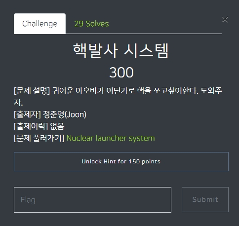
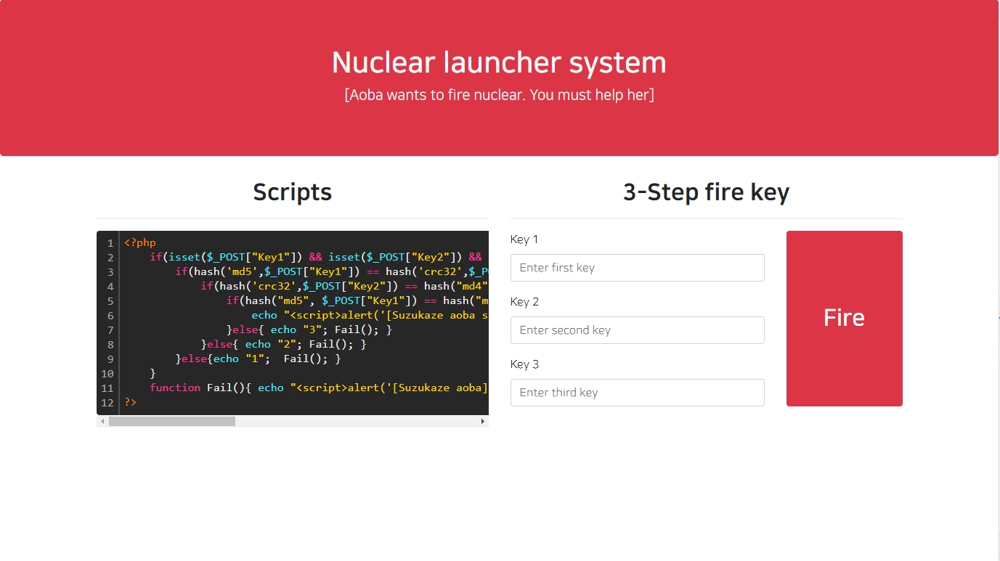
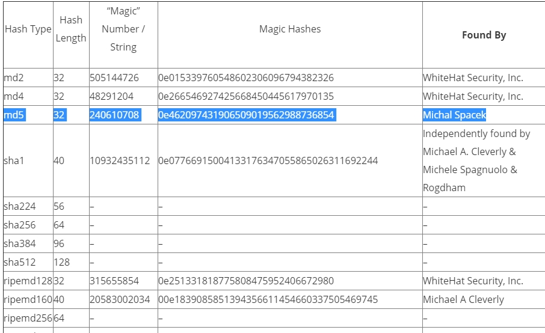
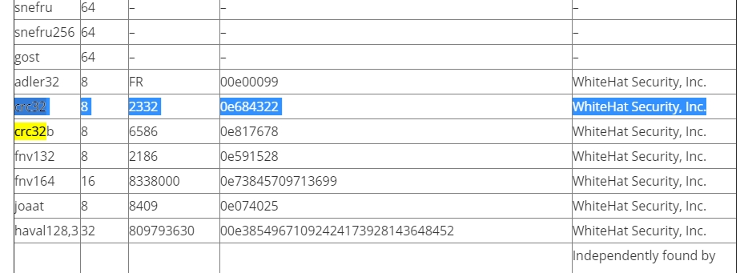
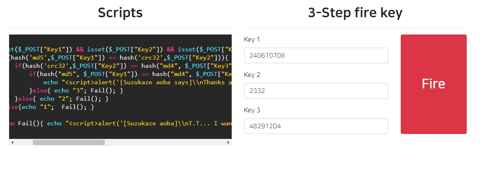
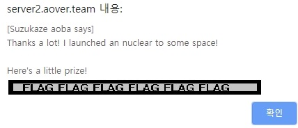

# 아오바 워게임 (https://wargame.aover.team/challenges)
이 문제는 아오바워게임 Nuclear_launch_system입니다.

## 문제 풀이 
맨 처음으로 문제를 클릭하면 사이트 하나를 또 던져준다. 

들어가면 발사 시스템 답게 키를 입력하라는 사이트가 뜬다. 

키 값을 입력하는 부분 옆에 스크립트를 자세히 보니 해쉬가 맞는지 틀리는지 확인하는 스크립트를 알수 있었다. 

여기서 나는 Magic hash를 생각할 수 있었다. 
 

Magic hash는 php에서 느슨한 비교(==)를 사용하는 경우에 발생하는 취약점이다. 

위험한 이유는 일치하는 해쉬가 아니어도 맞다고 판단할 가능성이 높기 때문이다.

이런 경우가 발생 하는 이유는 php type juggling때문인데 이것은 값에 대한 최적의 자료형을 찾아 주기 위해 선 탑재된 편의기능 이다. 

그래서 나는 whitehatsec.com에서 찾아서 입력했다. (https://www.whitehatsec.com/blog/magic-hashes/) 

 

 

 

그러면 flag를 뱉어낸다. (주인장의 요청으로 flag값 가림)
 
