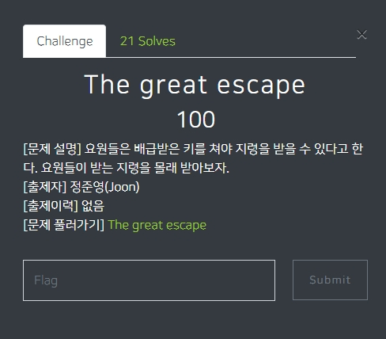
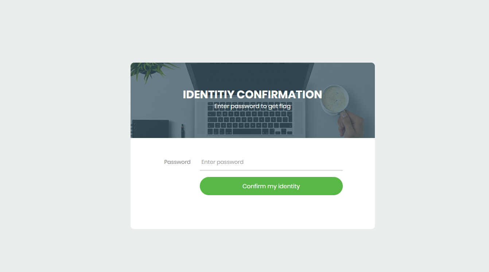
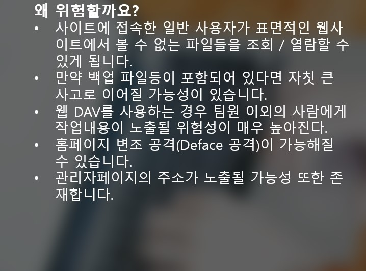
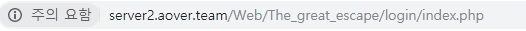
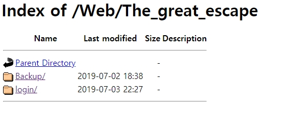
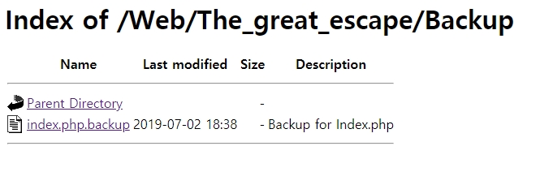
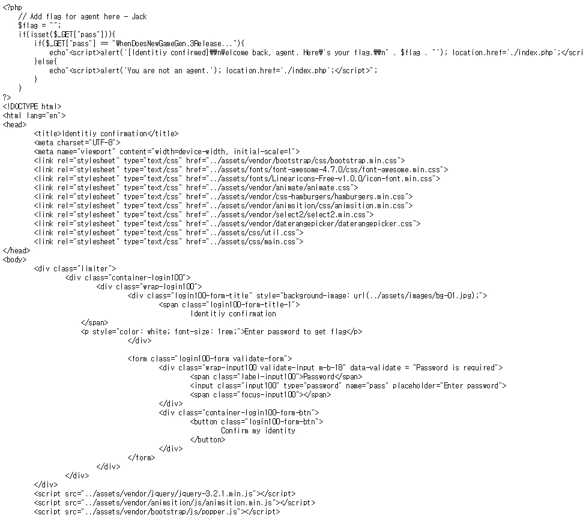
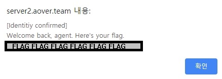

# 아오바 워게임 (https://wargame.aover.team/challenges)
이 문제는 아오바워게임 The great escape입니다.

## 문제 풀이 
맨 처음으로 문제에 들어가면 사이트 하나를 던져준다.

그 사이트로 들어가면 password칸에 입력 할 수 있는 칸을 준다.

보니깐 Directory listing 문제인걸 알 수 있었다. 

Directory listing는 Apache 또는 Nginx등의 웹서버에서 Indexes옵션을 꺼주지 않았을 떄 발생하는 취약점이며 구글에 "Index of /HDD1" 이라고 검색해도 많은 정보가 뜬다.

위험한 이유는 아래 사진과 같다. [ppt인용] 

그래서 이 사이트 주소를 보면 현재 이렇다. 

거기서 /login/index.php를 지우면 이러한 창이 뜬다.

이 창에서 Backup파일로 들어가게 되면 index.php.backup이라는 파일이 보인다. 

그 파일을 열어보면 php로 짜여있는 소스를 볼 수 있는데 여기에서 password에 넣을 값이 보인다. 

그 값을 넣으면 flag값이 나온다. (주인장의 요청으로 flag값 가림)

