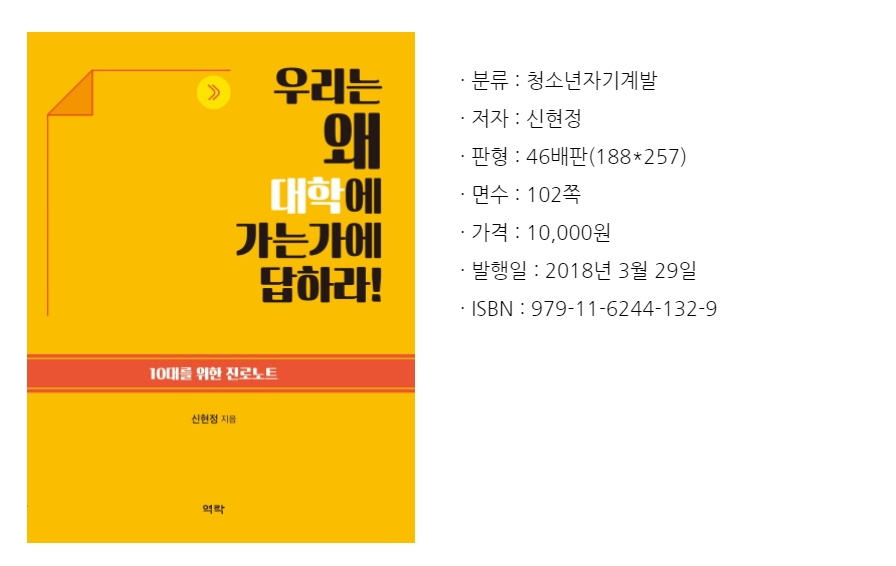

# 해킹과 보안의 세계

이 과정은 꿈의 대학에서 진행됩니다 ( 장소 : 대화고등학교)

## 강사 프로필

| 강사명 | 유승재교수 |
| :------------- | :------------- |
| 소속기관 직위 | 중부대학교 교수(고양캠퍼스) |
| 전공분야 | 정보보호 |
| 주요경력 | 중부대학교 학술정보센터소장 - 융합보안학회 부회장 - 전보통신기술센터평가위원 |

## 우리는 왜 대학에 가는가에 답하라!

처음 가자마자 받은 책이다.  
이 책은 신현정님이 지으신 책이다.  
신현정님은 중부대학교 교양학부 교수로 재직중이다.

책을 읽으면서 알게 되는 내용들 중 하나는 나의 진로 탐색이라 생각된다.  
이 책의 68페이지부터 뒤로 가게 되면 진로학습 성찰노트가 있다. 
이걸 로드맵이라고 부른다.

학습 내용중 새롭게 알게 된 흥미로운 사실이나 이해하기 어려웠던 내용이나 어떤 방법으로 해결할 것인가 까지
자신이 생각을 하여 작성 할 수 있는 칸이 있다는 게 좋다고 생각한다.

그리고 학습 과정을 요약해서 작성 및 자신의 참여도를 표시할 수 있고 개선 사항을 자신이 알아 갈 수 있다는
이 부분도 좋다고 생각된다.

## 정보보안을 위한 준비과정

일단 정보보안전문가는 it직업군 중 최상위에 있다

### 학습 과정

1. 시스템 중 오픈 소스로 알려 진 리눅스의 관련 된 자격증 -> 리눅스마스터 취득(국가자격증)
2. 네트워크도 정보 유출이 가능한 경로이다 -> 네트워크관리사 취득
3. 네트워크, 시스템, 정보보안 일반 -> 정보보안(산업)기사 취득(국가공인)
4. 프로그래밍 코 능력 배양 및 실무능력

## 정보보안 전문가 진출 분야

- 모의해킹/정보보안 컨설팅
- 보안솔루션
- 보안 관제
- 악성코드분석
- 디지털 포렌식 전문가

## 고등학교 떄 경험하면 좋은 것

- CodeGate
- HackingCamp (해킹캠프)
- 등등

