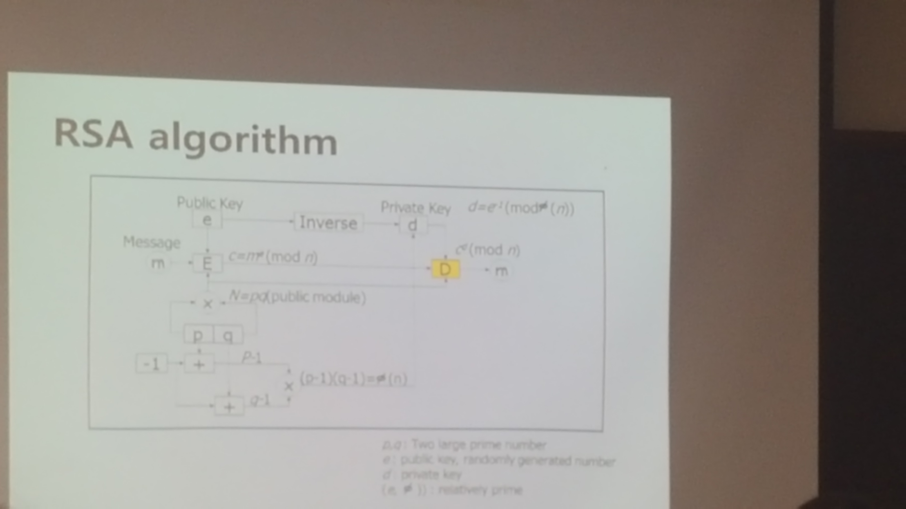
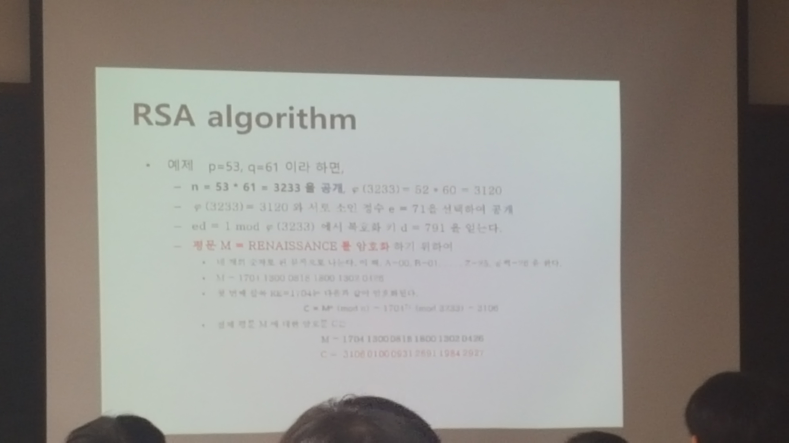
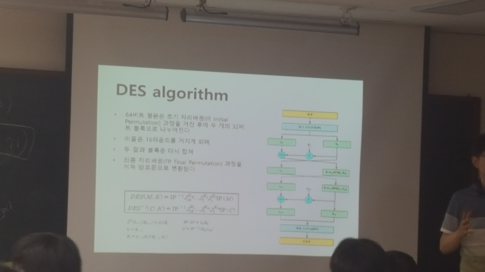
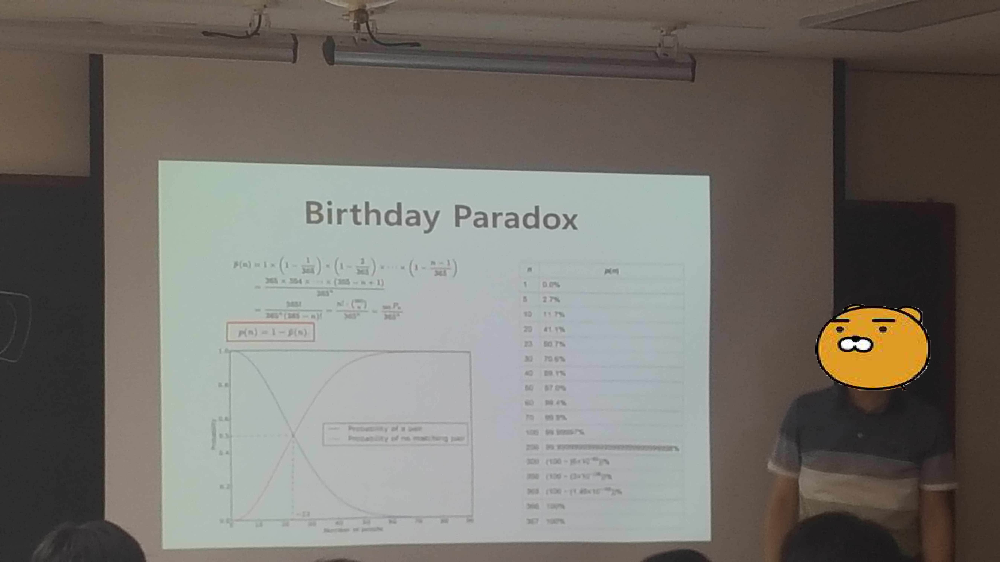
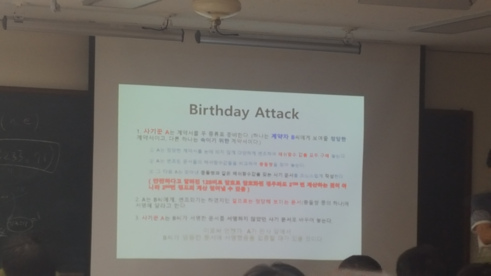

# 해킹과 보안의 세계

이 과정은 꿈의 대학에서 진행됩니다 ( 장소 : 대화고등학교)

## 대표적인 암호알고리즘

- RSA Algorithm

암호 시스템 장안자들 이름의 머리글자를 따온 것 (로널드 라이베스트(Ron Rivest), 아디샤미르(Adi Shamir), 레너드 애들먼(Leonard Adleman))  

1983년에 Mit에 의해 미국에 특허등록

RSA 암호체계의 안정성은 큰 숫자를 소인수 분해 하는것이 어렵다는 것에 기반

결론은 큰 수의 소인수 분해를 획기적으로 빠르게 할 수 있는 알고리즘이 발견된다면 이 암호체계는 가치가 떨어진다.

#### 예시

- DES Algorithm

블록 암호의 일종으로, 미국 NBS에서 국가 표준으로 정한 암호이다.
DES는 대칭키 암호이며, 56bit의 키를 사용한다  

DES는 현재로써는 취약한 것으로 알려져 있다.
56bit의 키 길이는 현재 컴퓨터 환경에 비해 너무 짧다는 것이 원인.

## 대표적인 해시알고리즘

- SHA-* Algorithm

- MD5 Algorithm

### birthday paradox

사람이 임의로 모였을 때 그 중에 생일이 같은 두 명이 존재할 확률을 구하는 문제이다. 

### birthday Attack

암호학적 해시 함수의 해시 충돌을 찾아내는 암호해독 공격으로, 생일 문제의 확률적 결과를 기반으로 한다. 

생일 문제에 따르면 해시 함수의 입력값을 다양하게 할수록 해시 값이 같은 두 입력값을 발견할 확률은 빠르게 증가한다. 

따라서 모든 값을 대입하지 않고도 해시 충돌을 찾아낼 확률을 충분히 크게 만들 수 있다.

