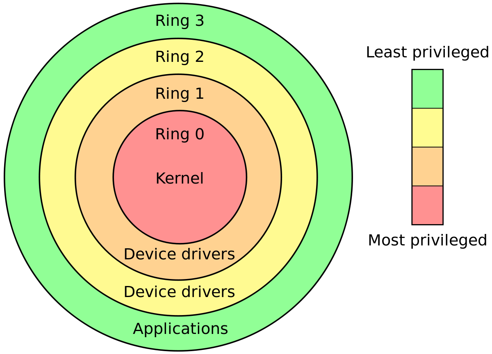

# 해킹과 보안의 세계

이 과정은 꿈의 대학에서 진행됩니다 ( 장소 : 대화고등학교)

## Visual Hacking

- Visual Hacking이란?

PC나 노트북으로 업무를 하는 중 누군가가 이 화면을 훔쳐보면서 정보를 탈취하는 것을 의미한다.

여러 현대적인 기술을 이용해 조직이나 고객의 사적인 정보를 빼내는 것도 포함된다. 

민감한 정보가 공개되는 곳이라면 어디든 일어날 수 있기 때문이다. 

업무환경에서 민감한 정보들이 노출되는 위험이 세계적으로 높다.

이러한 것 때문에 비주얼 프라이버시의 필요성이 조명된다

## 정보보호 전문가를 향하여

- 해킹 공격의 유형 (자원고갈, 가로채기)

  - Dos 공격
  - Boink, Bonk, Teardrop 공격
  - Land 공격
  - Smurf 공격
  - SYN Flooding 공격
  - Ping of Death 공격
  - Ip spoofing 공격
  - Sniffing 공격
  - DDos 공격
  - Dns spoofing 공격 등

- 정보통신망 침해 범죄

해킹으로는 계정도용, 자료유출 등이 있고 서비스 거부 공격이 있으며 악성프로그램이 있다.

- 정보 시스템에 대한 위협

정보 시스템에 대한 위협에는 방해(Interruption)와 가로채기(Interception), 불법변경(Modification), 그리고 위조(Fabrication)이 있다.

- 정보보안에 대한 요구사항

  - 기밀성 (Confidentiality)
  - 무결성 (Integrity)
  - 가용성 (Availability)
  - 부인방지 (Non-Repudiation)
  - 컴플라이언스 (Compliance)

- 정보보호전문가란?

네트워크/시스템과 보안 프로토콜, 보안 소프트웨어, 프로그램 및 구현, 보안 절차 및 Infra-structure 개발에 관한 경험과 업무지식을 보유한 전문가이다.

- 정보보호전문가가 되기 위해서는?

프로그램밍언어와 OS(시스템 운영체제), 네트워크와 DB(데이터베이스), 암호에 대한 이해와 지식이 필요하며 해킹공격기법과 침해대응, 바이러스 및 악성코드, 보안취약점 등등을 알아야 한다.

- 정보보호 산업

정보보호 산업에는 보안컨설팅서비스, 보안관제서비스, 교육훈련서비스. DDOS차단, 침입방지시스템, 방화벽, pc보안, 저작권 관리, 바이러스 백신 등이 있다.

- 정보보호 산업 동향

암호, 인증, 인식, 감시 등의 기반 기술을 바탕으로 정보보안에서 전 산업분야에 확산되는 융합보안으로 발전한다.

- 정보보호 산업 특징

창과 방패처럼 끝없는 진화 -> 발전하는 미래 신 성장산업

사이버 공간 생활비중 확대 -> 국민생활에 필수적인 사회 안전 산업

등등

- 정보보호 인력의 분류

1. 개발
2. 사전침투 / 방어
3. 사후 조사
4. 수집/해독
5. 진단 / 평가
6. 관리
7. 감독 / 총괄

- 직업

1. 보안제품 개발자 (개발)
  - sw분석/ 설계전문가
  - sw 개발자
  - 보안제품 기술자
  - sw테스트 기술자
  - 보안제품 기술영업

2. 침해사고 대응 전문가 (사전침투/ 방어)
  - 사이버 보안 관제사 (보안관제요원)
  - 취약성 분석 전문가
  - 모의 해킹 전문가

3. 디지털 포렌식 (사후조사)
  - 사이버 범죄 수사관

4. 악성코드 분석 전문가 (수집/ 해독)
  - 암호/ 해독 전문가 

5. 보안컨설턴드 (진단/ 평가)
  - 정보시스템 감리사
  - 정보시스템 보안감사
  - 보안제품 인증 전문가
  - 보안관리 인증 전문가
  - 보안기술 컨설턴트
  - 사이버 보안 관제사 (보안관제요원)

6. 보안관리자
  - 지식관리자
  - DB보안관리자
  - 정보시스템(네트워크)관리자
  - 보안시스템 관리자
  - 개인정보보호 관리자

7. 최고 보안 관리자 (보안전략전문가) [감독/ 총괄]
  - 보안관리 기획자
  - 준법 감시자
  - 보안 교육 전문가
  - 보안전문 검사/ 변호사
  - 개인정보보호 전문가
  - 국제보안 전문가
  - 보안전문 교수/ 기자

## windows 취약점을 이용한 시연 (Jung mo Lee)

#### Kernel 

- 정의

컴퓨터 과학에서 커널은 운영체제의 핵심부분이며 운영 체제의 다른 부분 및 응용프로그램 수행에 필요한 여러가지 서비스를 제공한다.

- 역할

보안, 자원관리, 추상화 등이 있다.

- 커널

Ring 구조로 되어있다.

- 시연 중에 나온 명령어 (조금)

  - !process 0 1 cmd.exe L1 
  - !process 0 1 System L1 
  - Type Nul > 내용 (내용이라는 파일을 저장함)
