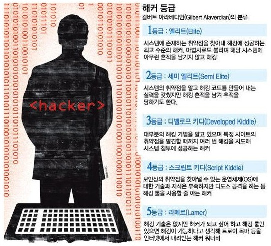
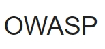

# 해킹과 보안의 세계

이 과정은 꿈의 대학에서 진행됩니다 ( 장소 : 대화고등학교)

## 해커의 정의 or 정리

- 컴퓨터 시스템의 내부 구조와 동작 따위에 심취하여 이를 알고자 노력하는 사람
-	이후 허가 받지 않은 남의 컴퓨터에 침입하여 시스템을 파괴/ 소프트웨어를 불법으로 복사 하여 배포하는 등의 범죄 행위를 행하는 사람으로 그 뜻이 변질

## 5개의 해커등급 

1등급 - 엘리트

2등급 - 세미 엘리트

3등급 - 디벨롭 키티

4등급 - 스크립트 키티

5등급 - 라메르

### 공격 대상시스템 침투 단계

1. 정보수집
2. 취약점 분석
3. 공격계획수립
4. 공격 실행
5. 사후처리

## Syn flooding 공격

- 클라이언트가 SYN만 보내고 아무런 동작을 하지 않는다면 해당 연결 요청은 TCP Connection Timeout 시간동안 계속 SYN Backlog Queue에 남아있음.
- 다수의 클라이언트가 고의로 이런 행동을 한다면 SYN Backlog Queue는 가득 참.
- SYN Backlog Queue가 가득차면 더이상의 연결요청을 받아 들일 수 없게 됨.

## 스니핑와 스푸핑

- 스니핑

 - 해킹 기법으로서 스니핑은 네트워크 상에서 자신이 아닌 다른 상대방들의 패킷 교환을 엿듣는 것을 의미함. 간단히 말하여 네트워크 트래픽을 도청(eavesdropping)하는 과정을 스니핑이라고 할 수 있음. 이런 스니핑을 할 수 있도록 하는 도구를 스니퍼(Sniffer)라고 하며 스니퍼를 설치하는 과정은 전화기 도청 장치를 설치하는 과정에 비유될 수 있음.

- 스푸핑

 - 해커가 악용하고자 하는 호스트의 IP 어드레스를 바꾸어서 이를 통해 해킹을 하는 것을 IP 스푸핑이다.

네트워크 시스템에서 서로 신뢰관계에 있는 A, B 두 시스템간에는 A 시스템의 어카운트를 가지고 B 시스템을 액세스 할 수 있음. 이는 네트워크에서 신뢰관계를 형성하는 서비스가 네트워크 주소에 기반하여 이를 인증하기 때문임. 이로 인해 IP 스푸핑이 가능해 진다. IP 스푸핑은 이 신뢰관계에 있는 두 시스템사이에서 해커의 호스트를 마치 하나의 신뢰관계에 있는 호스트인 것처럼 속이는 것암. 또한 IP 스푸핑과 항상 연동돼 사용되는 공격법으로 TCP sequence number guessing attack을 들 수 있음.

## 패스워드 크래킹 

- 공격 대상이 이미 ID를 알고 있다는 가정 하에 비밀번호를 알아내는 해킹 기법이다. 이 기법은 해킹 기법중 난이도는 낮은 편이나 가장 강력한 공격임.

## 백도어

- 컴퓨터 시스템 (또는 암호화 시스템, 알고리즘)의 백도어(backdoor)는 일반적인 인증을 통과, 원격 접속을 보장하고 plaintext에의 접근을 취득하는 등의 행동을 들키지 않고 행하는 방법을 일컫음. 백도어는 설치된 프로그램의 형태를 취하기도 하고, 기존 프로그램 또는 하드웨어의 변형일 수도 있다. 일반적으로 CCTV에 깔려서 정보를 빼어갈수도 있음.

## 해시함수

해시 함수(hash function)는 임의의 길이의 데이터를 고정된 길이의 데이터로 매핑하는 함수임. 해시 함수에 의해 얻어지는 값은 해시 값, 해시 코드, 해시 체크섬 또는 간단하게 해시라고 함.

## OWASP 
-	국제 웹 보안 표준 기구
-	3년마다 웹 어플리케이션 취약점 중 빈도가 높고 영향을 많이 줄 수 있는 공격 10가지를 선정하여 발표
-	잘 알려진 웹 서비스 관련 공격으로 SQL삽입공격, 크로스사이트 스크립트(XSS)

## SQL injection
- 응용 프로그램 보안 상의 허점을 의도적으로 이용해, 악의적인 SQL문을 실행되게 함으로써 데이터베이스를 비정상적으로 조작하는 코드 인젝션 공격 방법이다.
-	WAR를 이용하여 기본적인 sql 인젝션 공격을 탐지해 차단
-	자동화된 테스트 툴 -> sql닌자, sql맵, 하비즈

## Kim du hyeoung 님 강의

### index
 - Web programming lang
 - Web hacking tech
 - Trend analysis
 - War game

### http request or http response

### web hacking 방법
- cookie
- file upload를 통한 공격
- sql injection으로 클라이언트의 입력값을 조작하여 서버의 DB를 공격
- blind sql injection은 sql injection이 안될떄 사용 (쿼리결과에 따른 서버의 참과 거짓반응을 통해 공격 수행)

### CSRF
-> 공격대상 : 서버
-> xss존재시 csrf 취약점 확률 90%
-> 사용자가 자신의 의지와는 무관하게 공격자가 의도한 행위를 특정 웹 사이트에 요청하게 하는 공격
-> how?
 - 공격자 : csrf스크립트가 포함된 게시물
 - 사용자 : 게시물 열람
 - 서버에서 스크립트가 포함된 게시물 응답
 - 사용자 권한 => 공격자
