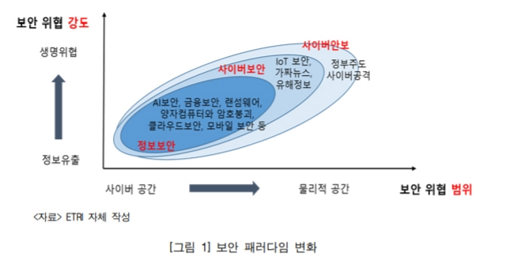
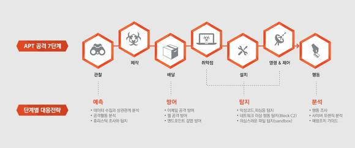
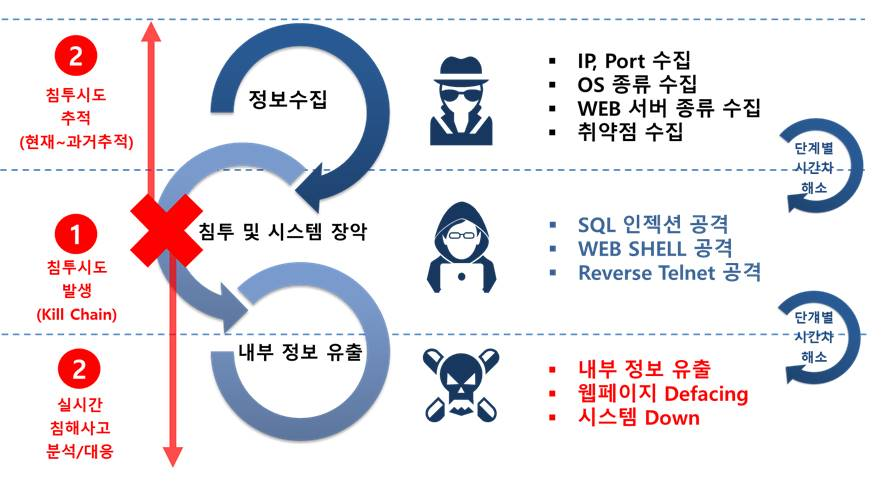
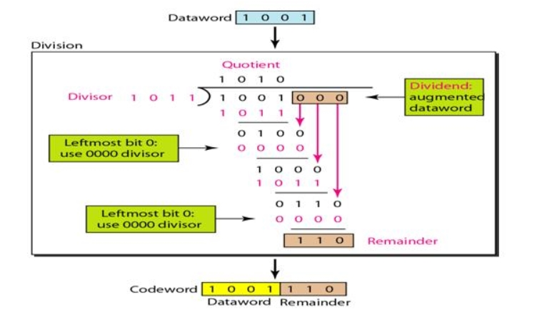

# 해킹과 보안의 세계

이 과정은 꿈의 대학에서 진행됩니다 ( 장소 : 대화고등학교)

## 4차 산업혁명시대의 정보보호개념

- 정보보안 (information security)
- 사이버보안 (cyber defense)
- 사이버안보 (cyber security)

## 보안 패러다임의 변화 

## 신규 보안위협

- 양자 컴퓨팅
 - 기존 암호체계의 붕괴 위험성
 - 복제 불가능한 암호통신 기술 (포스트 양자암호기술)

- 랜섬웨어
 - 신기술로 익명화된 랜섬웨어 공격주체들이 증가

- 전자금융기관를 대상
 - 블록체인 기술로 보안문제의 해결 기대.. (좋지 않은 선택)

- 인공지능
 - 사이버 공격 수단으로 인공지능기술을 활용 조짐 확산

- IOT기기 보급 확산
 - 사이버 공격 피해 확신
 - 오픈소스를 활용하는 틀징 등 -> 보안 취약점이 높은 뿐만 아니라 공격에 쉽게 노출
 - 웨어러블 디바이스 통해 수집한 개인의 심리 및 생리적 데이터를 조작하여 생명을 위협

## 사이버 안보

- 국가 사이버안보정책을 총괄하는 사이버안보 거버넌스 체계 (미국)

- 네트워크보안팀을 제정하여 사이버 공간의 주권과 사이버보안 체계 전략 수립 (중국)

- 사이버안보 위협에 대응하여 "사이버 킬 체인"개념을 중심으로 사이버 안보 대응책을 마련할 필요 (미국 방위산업체 룩히드 마틴이 제안)

- 공격체인모델

## 보호하기 위해서는 

- 보안을 내재화하는 개념적용
- 능동적이고 적극적인 보안 전략 추진
- 국가차원에서 사이버전쟁에 대비한 기술적 대응책 마련 필요
- 신 기술을 악용한 사이버공격에 대응하기 위해서는 신규 보안기술을 준비

## 리버싱

- 언어분석이 중요
- 게임해킹할떄 많이 쓰고 예로는 피파온라인2의 시간버그, 롤의 여러가지 버그, 오버워치 오토핫키 등이 있음
- 수강신청 매크로 등
- CRC알고리즘

