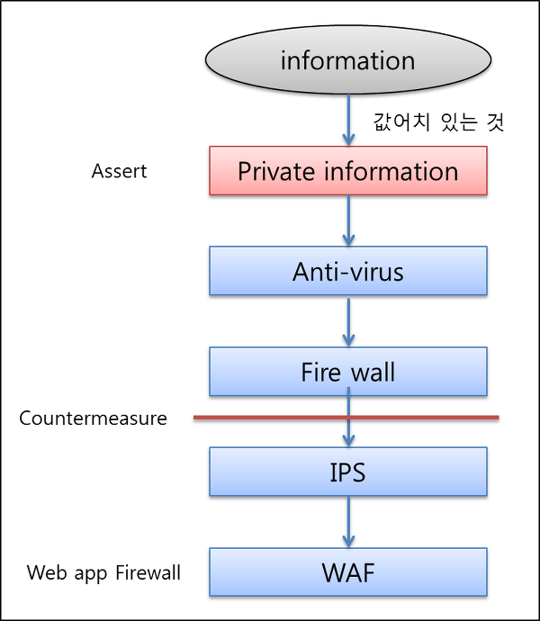
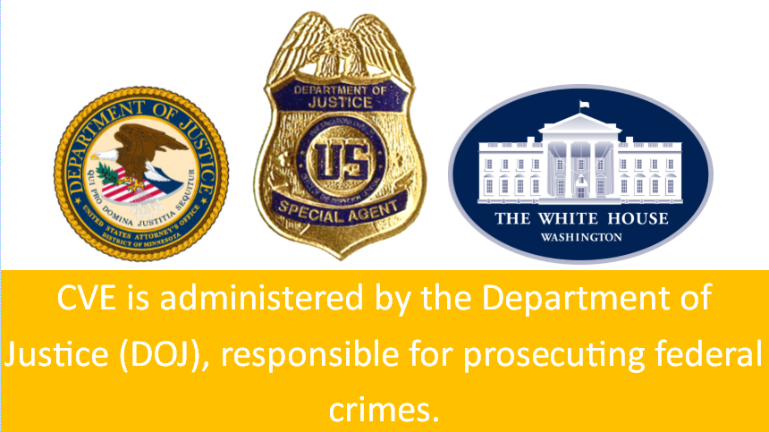
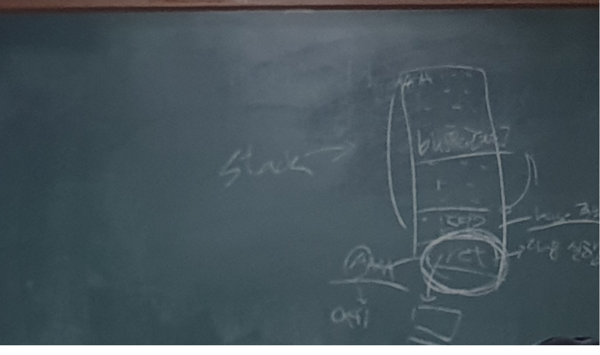
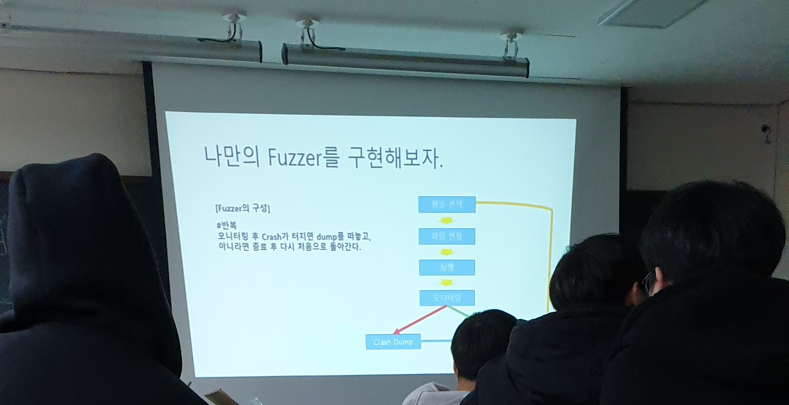

# 해킹과 보안의 세계

이 과정은 꿈의 대학에서 진행됩니다 ( 장소 : 대화고등학교)

## 네트워크 보안의 이해
- 네트워크에 승인 되지 않은 침입이 일어나는 것을 방지하고 보호하는 일련의 실행  
- 개별적인 디바이스에 중점을 둔 Endpoint보안을 보완하며, 이들 Endpoint디바이스가 서로 간의 결합 조직 상에서 어떻게 상호작용 하는지에 중점  
- 물리적 or 소프트웨어 방어도구를 이용해서 기반 네트워크 인프라를 승인되지 않은 엑세스나 오용, 오동작, 수정, 파괴, 부적절한 노출 등으로부터 보호하는 프로세스  
- 컴퓨터와 사용자, 그리고 프로그램이 승인 된 핵심 기능을 안전한 환경에서 수행할 수 있도록 보안 플랫폼을 만든다.

# 네트워크의 기본 구성
- 기본 구성 : 보호 -> 탐지 -> 대응
- 보호 : 시스템과 네트워크를 최대한 올바르게 설정...
- 탐지 : 설정이 변경되거나 일부 네트워크 트래픽에 문제가 생기면 이를 파악할 수 있어야 한다.
- 대응 : 문제를 신속하게 파악한 후 대응조치를 취하고 가능한 빨리 안전한 상태로 돌아가야…

# 중심방어 (Defence in depth)
- castle approach라고도 알려진 Defense in Depth는 정보 보증 개념이다.
- 이때 보안 컨트롤(방어)의 다수의 계층은 정보 기술(IT) 시스템 전반에 배치되어있다.
- Defense in Depth는 몇가지의 독립적인 방법을 사용하여 특정 시스템의 공격에 대한 방어를 목적으로 한다.
- 정책, 절차, 보호 메카니즘의 배치는 IT 시스템의 신뢰성을 증가시키기 위함이고 다수의 방어 계층은 중요한 시스템에 대한 직접적인 공격과 스파이를 예방한다.
- 컴퓨터 네트워크 방어 측면에서 Defense in Depth는 공격에 응답하고 방어하여 조직에게 시간을 벌어다 주어 보안 침투를 예방할 뿐만 아니라 경감시키는 결과를 제공한다.

# 네트워크보안 방법론 (시스코의 제품군 참조)
- 엑세스 제어
- 안티멀웨어
- 애플리케이션보안
- 행위분석
- 데이터 손실방지
- 방화벽
- 네트워크 세그먼테이션
- VPN
- 웹보안
- SIEM
- 모바일 디바이스 및 무선보안
- 침입탐지 및 방지
- 이메일 보안

# 클라우드 설명
- IT와 관련된 다양한 자원(하드웨어, 플랫폼, 소프트웨어 등)을 웹이라는 거대한 구름 속에 넣어두고 이러한 자원이 필요한 사용자의 요청에 따라 네트워트를 통해 필요한 정보를 신속하게 제공하는 모델을 말합니다.

# 클라우드 한계점
- 보안
- 변경의 어려움
- 보다 큰 공간
- 인터넷 없이 불가능

# 네트워크 보안 소프트웨어
- 네트워크 방화벽
- 통합위협관리(UTM)
- 차세대 방화벽
- 망분리 방화벽
- 데이터베이스 방화벽
- 웹 애플리케이션 방화벽 (WAF)
- 컨테이너 방화벽
- 클라우드 방화벽

# 네트워크 보안 툴 
- 네트워크 상에서 벌어지는 일을 추적하기 위해 다수의 툴을 배치해야 함
 - 패킷스니퍼
 - 취약점 스캐너
 - 침투 테스트 소프트웨어
 - 침입 탐지 및 방지 소프트웨어

# 네트워크보안 자격증
- CISSP
- CompTIA의 NETWORK+
- CCNA
- CCNP 
- CHE

# 황선홍(fkillrra)님 수업 
- CVE를 재구현

# CVE
- Common Vulnerabilities and Exposures
- [표기법] : CVE-해당년도-취약점번호
- https://cve.mitre.org

# Bug bounty
- 허락한 회사의 제품 or 사이트의 취약점을 발견하고, 이를 해당회사에 제보하여 그에 따른 포상금을 받는 제도

# CVE-2009-1330
- Easy RM to Mp3 Converter에 대한 CVE
- https://www.exploit-db.com/exploits/10602/

- tested on windows xp sp3
- Poc was developed in Perl
- Description : Stack Local Buffer Overflow
- File type is m3u

# stack에 관한 추가 설명

# 하는 방법?
- Step 0. 디버깅 설정
- Step 1. Crash 확인
- Step 2. OFFset 확인 (Metasploit를 이용해 Patten_create.rb으로 patten을 확인후 patten_offset.rb으로 offset확인)
- Step 3. Jmp esp 가젯 찾기 (이유 : process stack의 주소에 NuLL byte가 들어가 있음)
- Step 4. Exploit

# Fuzzing
- 소프트웨어 테스트 기법으로서, 컴퓨터 프로그램에 유효한, 예상치 않은 또는 무작위 데이터를 입력하는 것이다.

- Mutation 기법
 - Mutation(변이) 기법으로, 주어진 입력 값을 마구잡이식으로 이리저리 바꿔가면서 새로운 입력값을 만들어내는 것입니다. 이러한 방식은 데이터의 형식이나 구조에 대한 명확한 이해가 어려울 때 사용하는것이다보니, 때로는 너무나 노가다 같은 느낌이 강해서 ‘dumb(멍청한) 퍼징'이라는 이름으로 불리기도 합니다.

- Generation 기법
 - Dumb Fuzzer와는 대조적으로, 파일의 포맷(형식)이나 프로토콜(규약)을 이해하고 그것에 맞추어 적절한 input을 생성하는 방식이 바로 Generation 기반 퍼징이며, 명세에 따라 밑바닥부터 철저히 구현해야 하므로 때로는 Intelligent(지능적인) Fuzzer라고 불리기도 합니다

- 나만의 fuzzer 만들기

