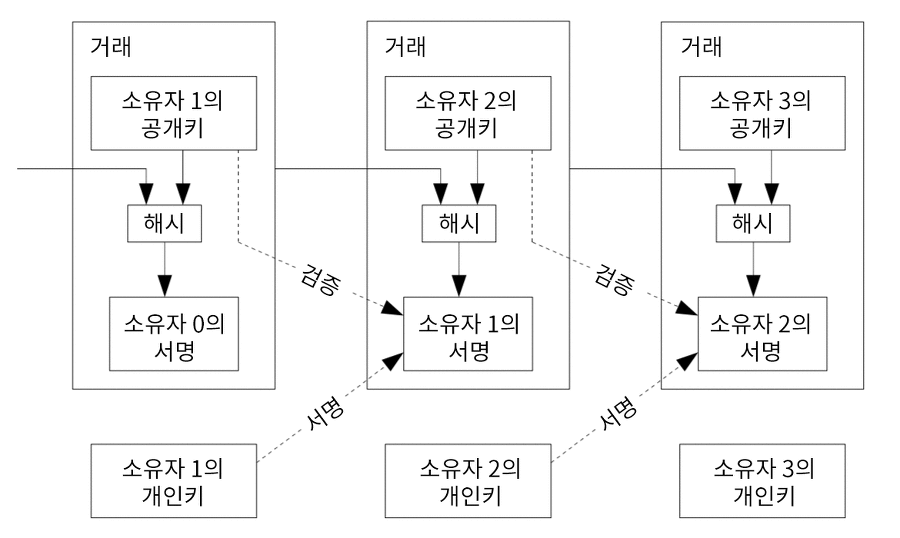
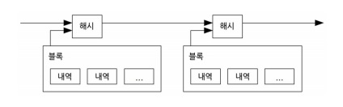
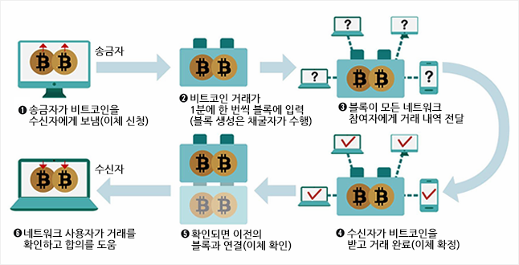
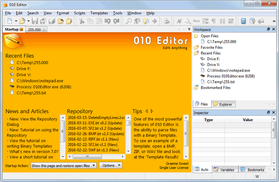
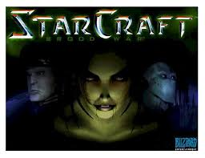
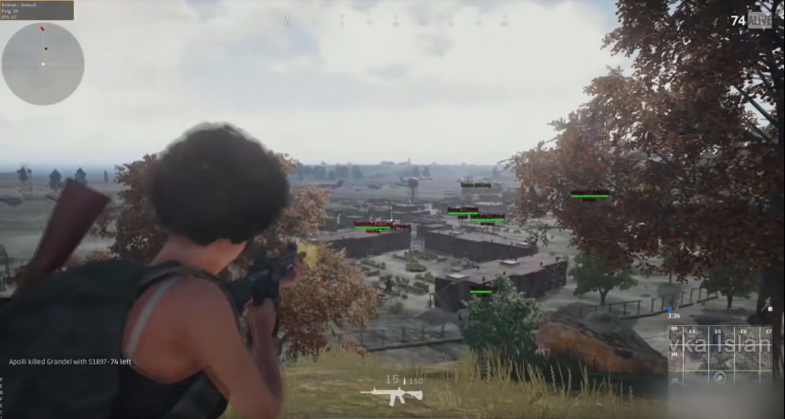
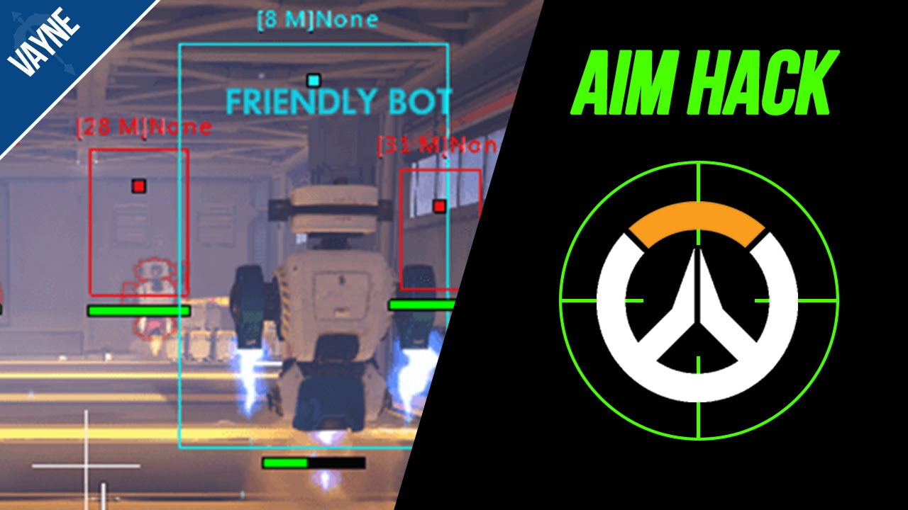

# 해킹과 보안의 세계

이 과정은 꿈의 대학에서 진행됩니다 ( 장소 : 대화고등학교)

## bitcoin : A Peer-To-Peer Electronic Cash System

- 디지털 서명은 해결책의 일부를 제공하지만 이중사용(이중지출)을 방지를 위한 제3신뢰기관(신뢰할 수 있는 서드파티)이 지속적으로 필요

- 전자화폐의 순수 P2P버전은 금융기관을 통하지 않고 일반당사자로부터 다른 당사자로 직접 보내는 온라인 지불수단을 이용

### P2P네트워크를 사용하여 이중사용 문제에 대한 해결책을 제안
 
- 계속 진행되고 있는 암호화 기반 작업증명 과정의 연쇄 상에서 네트워크 시간 및 거래를 암호화하여 기록을 생성  ->작업증명의 재작업 없이는 변경될 수 없는 리코드 형성

- 가장 긴 체인은 각 사건 순서를 입증 & 가장 많은 컴퓨팅 파워가 입증했다는 것을 의미

- 노드들에 의해 제어되는 컴퓨팅 파워의 과반수 이상이 협력하여 네트워크를 공격하지 않는 한, 그들은 가장 긴 체인을 생성하며 네트워크 공격자를 능가하게 될 것

### 공격자를 능가하기 위해 네트워크가 요구하는 최소한의 구조는

- 각 노드들은 자발적으로 그 네트워크를 떠나거나 다시 합류할 수 있고
- 그 사이 어떤 일이 벌어졌는지에 대한 입증을 위한 가장 긴 작업증명 체인을 받아들이는 노드들의 메시지가 최대한 공유

- 이중지불을 하지 않았는지 확인하기 위해서는 
 - 모든 거래가 공개적으로 알려져야 하고
 - 참여자들이 시간 순서에 따라 단말거래내역으로 수용하는 시스템 필요

### 네트워크 실행단계(동작과정) 

- 1)새로운 거래 내역이 모든 노드에 알려진다
- 2)각 노드들은 새로운 거래 내역을 블록에 취합한다
- 3)각 노드들은 그 블록에 작업증명을 찾는 과정을 수행한다.
- 4)어떤 노드가 작업증명을 성공적으로 수행했을 때, 모든노드에게 그 블록을 전송한다
- 5)노드들은 그 블록이 모든 거래가 이전에 쓰이지 않고 유효한 경우에만 승인한다.
- 6)노드들은 자신이 승인한 블록의 해시를 이전 해시로 사용하여 다음 블록을 생성하는 과정을 통해 그 블록이 승인되었다는 의사를 나타낸다.

- 만약 두개의 노드가 서로 다른 버전의 다음 블록을 동시에 알리게 될 경우
 - 각 노드들은 자신이 먼저 받은 블록에 대해 작업을 수행하지만, 체인의 다른 길이로 더 길어질 경우에 대비해 체인의 어느 한쪽 갈래가 더 길게 생성되는 작업증명이 알려지면 체인 갈래와 길이는 더 이상 이용하지 않게되고, 각 노드들은 체인이 더 긴 갈래로 작업한다.

### 기타

- 보상 : 노드가 네트워크를 지원하기 위해 인센티브를 추가하는것 (거래내역 블록생성의 보상 가치(컴퓨터자원/전력/수수료...))

- 저장공간 재확보 : 지나간 거래내역은 저장공간의 확보를 위해 버려져도 된다. (Merkle Tree구조의 루트부분만 블록해시에 포함) 

- 단순화된 지불검증 : 전체 네트워크 노드를 실행하지 않고 지불을 검증하는 것이 가능

- 금액의 결합과 분할 : 지불/거스름돈

- 개인정보보호

- 계산

### 블록체인

- 2009년 비트코인의 오리지널 소스코드에 처음 도입된 분산데이터 저장 기술

- 원장에서 소유자를 확인하기 위해 공개 키 암호화 방식을 적용

- 네트워크 내에 수많은 사용자 PC에 분산 저장된 기록(노드)들은 서로가 서로에게 신뢰를 확인하는 기준이 된다.
 
 - 새로운 거래가 발생 (ex 기존 거래에 대한 수정발생)
 - 새로운 블록이 제안
 - 이에 대해 블록체인 내의 다수 노드는 일정한 알고리즘을 실행
 - 제안된 블록의 내역을 평가하고 검증해 해당 내역과 서명이 유효하다는 합의를 도출
 - 새로운 거래가 원장에 수록되고 블록체인에 새로운 블록이 추가

### 블록체인의 보안 취약점

- 블록체인 기술 자체는 안전, 하지만 이를 적용해 운영되는 서비스 또는 시스템 상의 보안 취약점

 - 개인적 보안이슈
  - 개인키 관리 시 외부 공격에 취약, 키 도난 및 분실
  - 전자지갑 SW의 잠재적 취약점
 
 - 블록체인 기술적 보안이슈
  - 블록체인 네트워크의 51% 이상 해커가 장악 시 결과 조작 가능
  - 다른 암호 화폐간 거래 시 표준화된 알고리즘, 월렛 SW 등 부재

 - 외부공격에 의한 보안이슈
  - 프라이빗 블록체인 운영 기관의 부당한 권한 행사
  - 블록체인 네트워크에 과부하 주는 DDoS 공격

### 블록체인 패러다임 _비트코인

- 비트코인이 각광받는 이유 : 블록체인의 특성
 
 - 기록의  보관 비용,절차 등의 효율 : 중개자의 역할이 필요 없음
 - 투명성을 보장 : 금융기관을 통해 장부를 관리하지 않고 블록체인에 연결된 모든 이에게 공개
 - 무결성 신뢰 : 기록이 조작되려면 기술적 원리에 따라 과반수 이상의 블록이 동시에 조작되어야 하기 때문에 사실상 불가능

- 블록체인의 기술을 활용한 좋은 사례 중 하나일 뿐

## POVGODD(?) 님 강의

### List
 - 라이센스 시리얼 정리
 - 리버싱 소개 및 하는 역할
 - 라이센스 시리얼 해킹 사례
 - 실제 해킹하는 영상
 - 영상 보충설명

### Reversing
 - 장치 또는 시스템의 기술적인 원리를 이해하여 단점을 보안하고 새로운 아이디어를 추가시키는 일련의 작업
 
 - 일반적인 소프트웨어 제작 과정 (소스 코드 작성 -> 컴파일/링크 -> 실행 가능한 binary파일)

 - 리버싱 과정 (Binary해석 -> 프로그램 이해 )

### Precautions

- 리버싱 자체는 불법이 아니지만 리버싱을 이용해서 타인의 기술과 소스등을 무단으로 도용하는 방법은 불법입니다. 악의적인 목적으로 사용하시면 안되며, 공부 목적으로 사용하시기 바랍니다.

### 스타크래프트 1 올리디버그로 하는 방법

- 사실 영상이 있었는데 날려먹었다고 하심
- 그래서 일일이 사진이라 패스

### 해킹 예제

- 010 editor 크랙  

- starcraft 1 (cd키로 설치하는거) 크랙  

- 배그 핵

- 오버워치 핵

- 등등등

