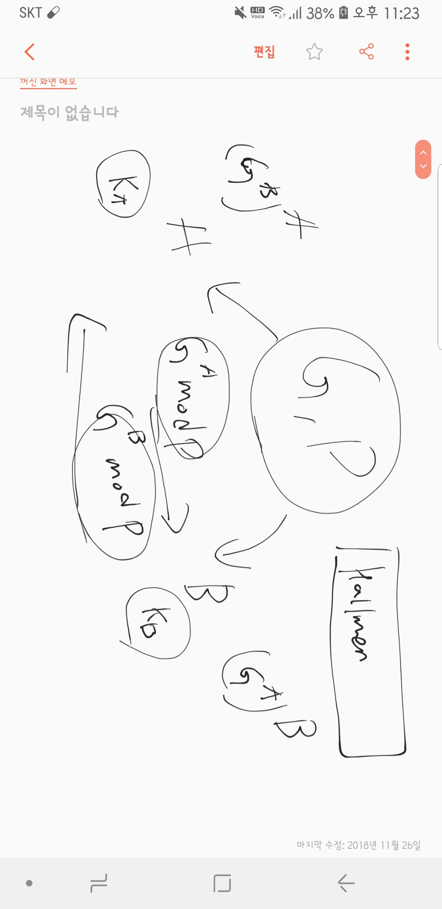
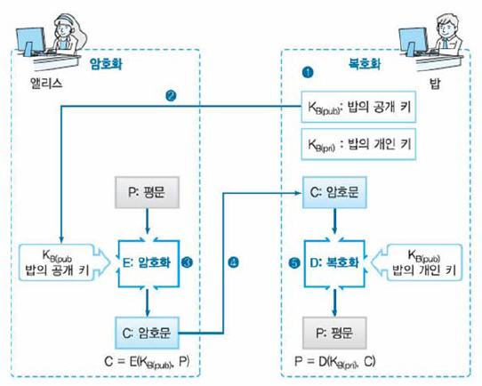
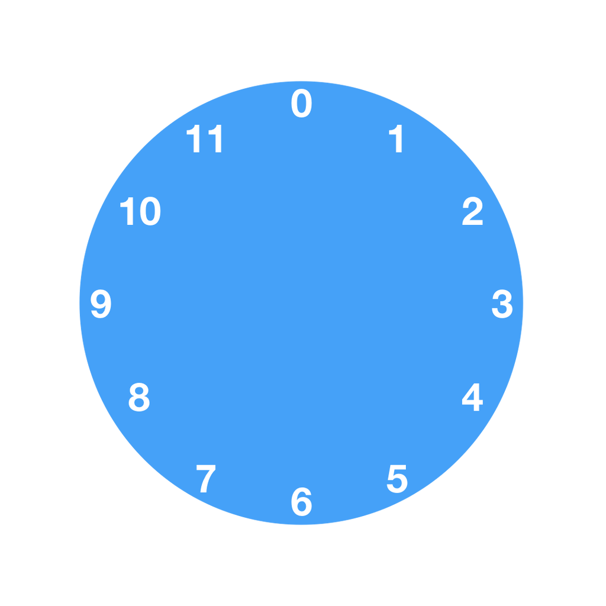
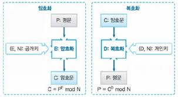
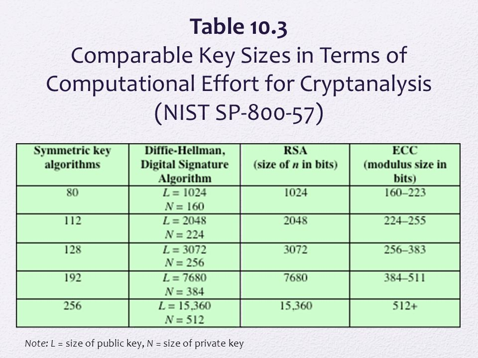

# 해킹과 보안의 세계

이 과정은 꿈의 대학에서 진행됩니다 ( 장소 : 대화고등학교)

## 공개 키 암호의 이해

 1. 키 배송 문제
 2. 공개 키 암호
 3. 시계 연산
 4. RSA
 5. RSA에 대한 공격
 6. 다른 공개키 암호
 7. 공개 키 암호에 관한 Q&A

## Section 01 키배송 문제
 - 1. 키배송 문제란?
 - 2. 키의 사전 공유
 - 3. 키 배포 센터에 의한 키 배송
 - 4. Diffie-Hellman 키 교환에 의한 키 배송
 - 5. 공개 키 암호에 의한 키 배송

## 1. 키 배송 문제란?
 - 대칭 암호 사용시 송신자와 수신자가 대칭키를 사전에 공유해야 하는 문제
 - 엘리스(송신자)가 메일을 암호화 할떄 사용했던 대칭 키를 보내지 않으면 밥(수신자)은 복호화 할 수 없다.

## 2. 키의 사전 공유에 의한 키 배송
 - 직접전달은 안전
 - 이메일/일반메일 등은 위험
 - 인원이 많아지면 관리 해야 할 키의 수 증가
 - 기술적으로 고려할 의미 없음
 
## 2-1 키의 사전 공유에 의한 키배송 예시
 - 1000명의 사원 한 사람 한 사람이 자신 이외의 999명과 통신할 가능성이 있다고 하면, 통신용 키는 1인당 999개가 필요
 - 회사 전체로 필요한 키의 수 (nCr)  (1000*999)/2 = 49만9500개
 - 사용자 수가 많아지면 현실적이지 못한다

## 3. 키 배포 센터에 의한 키 배송
 - 키 배포 센터 (Key distribution center, KDC)
 - 암호 통신 때마다 통신용의 키를 키 배포 센터에 의뢰해서 개인과 키 배포 센터 사이에서만 키를 사전에 공유
 - (예) 키 배포 센터의 역할을 하는 컴퓨터를 지정
 - 데이터베이스에 이용자(구성원) 전원의 키 보관
 - 전 구성원은 각자 자신의 키 보존

## 3-1 키 배포센터의 문제점
 - 구성원 수 증가 시 키 배포 센터의 부하
 - 키 배포 센터의 컴퓨터가 고장 시 조직 전체의 암호 통신 마비
 - 키 배포센터가 집중 공격의 대상이 될 수 있다.

## 4. Diffie-Hellman키 교환에 의한 키 배송
 - 암호 통신을 원하는 두 사람이 있다면 어떤 특정 정보를 교환한다 (이 정보는 도청자에게 노출 되어도 무방)
 - 두 사람은 교환한 정보를 가지고 동일한 키를 각각 생성할 수 있다.
 - 하지만 도청자는 같은 키를 만들 수 없다
 - 1976년도에 휘트필드 디퍼와 마틴 헬먼이 발명한 알고리즘

## 5. 공개 키 암호에 의한 키 배송
- 공개 키 암호
 - 대칭 암호
 - [암호화 키]와 [복호화 키] 동일

- 공개 키 암호
 - [암호화의 키]와 [복호화 키] 다르다
 - [암호화 키]를 가지고 있다면 누구든지 암호화 할 수 있지만,
 - 복호화 할 수 있는 것은 [복호화 키]를 가지고 있는 사람 뿐임
 - [암호화 키]로는 복호화 할 수 없다.

## 5-1 공개 키 암호에 의한 키 배송 문제의 해결
- 공개 키 암호
 - 수신자는 미리 [암호화 키]를 송신자에게 알려준다.
 - 송신자는 그 [암호화 키]로 암호화해서 수신자에게 전송
 - 암호문을 복호화 할 수 있는 자는 [복호화 키]를 가지고 있는 사람(수신자)뿐
 - 이렇게 하면 [복호화 키]를 수신자에게 배송할 필요가 없음

## 공개 키/ 개인 키 의미
- 공개 키 (Public key)
 - [암호화 키]는 일반에게 공개해도 무방
 - 수신자에게 메일로 전달해도 무방
 - 신문의 광고란에 실어도 무방
 - 간판으로 해서 길가에 세워도 무방
 - Web페이지를 통하여 전 세계에서 읽을 수 있도록 해도 무방
 - 도청자에게 공개 키가 도청되는 것을 신경 쓸 필요가 없다
- 개인 키 (Private key)
 - [복호화 키]는 미공개
 - 이 키는 비밀키로 본인만 사용
 - [누구에게도 노출되거나, 전달되어서는 안됨]

## 공개키 - 개인키 쌍
- 키 쌍 (Key Pair)

- 공개 키 와 개인 키는 둘이 한쌍
 - 공개 키로 암호화한 암호문은 그 공개 키와 쌍이 되는 개인 키가 아니면 복호화 할 수 없다.

- 수학적인 관계
 - 키 쌍을 이루고 있는 2개의 키는 서로 밀접한 관계
 - 공개 키와 개인 키 쌍은 서로 별개로 만들 수 없음

## 여러가지 용어
- 대칭 함호 (Symmetric Cryptography)
 - 동일키 사용해서 암호화와 복호화 수행
 - 암호화와 복호화가 마치 거울처럼 대칭
 - 키: 비밀 키 (Secret key)라고 함

- 비대칭 암호 (Asymmetric Cryptography)
 - 대칭 암호와의 대비
 - 암호화와 복호화에 다른 키 사용
 - 키: 개인키와 공개키

## 공개 키 암호로도 해결할 수 없는 문제
- 공개 키의 인증에 관한 문제
 - 입수한 공개 키의 진위를 판단할 필요
 - 중간자공격 (man-in-the-middle attack)

- 공개 키 암호의 속도
 - 대칭 암호에 비해 처리 속도가 현저히 느림

## 중간자 공격 (man in the middle attack, MITM)
- 네트워크 통신을 조작하여 통신 내용을 도청하거나 조작하는 공격
- 통신을 연결하는 두 사람 사이에 중간자가 침입하여, 두사람은 상대방에게 연결했다고 생각하지만 실제로는 두 사람은 중간자에게 연결되어 있으며 중간자가 한쪽에서 전달된 정보를 도청 및 조작 후 다른 쪽으로 전달
- 많은 암호 프로토콜은 중간자 공격을 막기 위하여 인증을 사용 (예 : TLS/SSL프로토콜은 공개 키를 기반으로 한 인증을 사용)

## 중간자 공격 동작원리
- 스니핑 (sniffing)
 - 스니핑 또는 패킷 스니핑 : 시스템/네트워크에서 들어오고 나가는 데이터 패킷을 캡쳐하는데 사용 되는 기술
- 패킷 인젝션 (packet lnjection)
 - 공격자가 일반 데이터와 함께 악의적인 데이터를 주입하는 것 
 - 사용자는 합법적 통신 스트림 일부로 제공되기 때문에 파일/멀웨어 프로그램 미탐지
- 세션하이재킹 공격 (Session Hijacking)
 - 일명 세션 가로채기라고 불리는 공격 : 두 시스템 간 연결이 활성화된 상태를 가로채는 것으로 "Session Expired" 오류가 발생
- SSL 스트리핑 (SSL Stripping)
 - 공격자는 SSL/TLS연결을 차단하여 프로토콜이 보안성이 있는 HTTPS에서 안전하지 않은 HTTP로 전환

## 시계 연산 (MODULO연산)
 1. 덧셈
 2. 뺄셈
 3. 곱셈
 4. 나눗셈
 5. 거듭제곱
 6. 대수
 7. 시계 바늘에서 RSA로

## 덧셈
- 시계를 사용한 덧셈
 - 지금 바늘이 7를 가르키고 있을 떄 
 - 오른쪽으로 2 눈금 보내면 바늘은 어디를 가르키는가?
 - 9를 가르킨다

 - 바늘이 7을 가르키고 있을 떄 
 - 오른쪽으로 6 눈금 보내면 바늘은 어디를 가르키는가?
 - 과연 13일까?

## 모드 계산
- mod (나눗셈을 해서 나머지를 구하는 계산을 위한 기호)

- 27 mod 12
 - 27를 12로 나눈 나머지
 - 27 mod 12 = 3
 - [27과 3은 12를 제수로 해서 합동이다]라고 표현

## 뺄셈
- 뻴셈이라는 것은 덧셈의 역의 연산
- 시계의 바늘을 왼쪽으로 돌리면 되는 것
- 그런데 이 시계는 오른쪽으로만 돌아간다
- 그러면 뺄셈은 어떻게 하면 될까?

- 답은 (X+Y) mod 12 = 0이 되는 X와 Y의 짝

## 곱셈
바로 예시로 들어간다

- 7 x 4 mod 12
 - = 4
 - 위의 계산을 통해 4가 구해졌다
 - [{7 눈금 오른쪽으로 돌리는} 조작을 4번 반복하면, 분명히 바늘은 4를 가르킨다]

## 나눗셈
뺄셈을 생각 할때 덧셈의 역 연산을 생각한 것 처럼 곱셈의 역 연산을 생각
- 예시) 7 x ㅁ mod 12 = 1
 - 7에 ㅁ를 곱해서 12의 mod를 취했더니 1이 되었다. 이때의 ㅁ는 무엇일까?
 - 바늘의 조작으로 생각하면 [{7눈금 오른쪽으로 돌리는}조작을 몇 회 반복하면 1이 되는가?]하는 문제

- 역수를 가지고 있는 수는 1,5,7,11
 - 그러면 이들 수에는 어떤 성질이 있는가?
 - mod 12의 세계에서 역수를 갖는 수는 12와 그 수가 1이외의 공통의 약수를 갖지 않는 수이다.

## 대수
거듭제곱의 역 연산은 대수라 불리고 있다
 - 보통의 수학에서는 대수를 구하는 계산은 그다지 어렵지 않다
 - 예시) 7의 x 제곱 = 49
 - x = 2라는 것은 금방 알 수 있다.
 - 비록 숫자가 커져도 대수를 구하는 계산은 그다지 어렵지 않다.
 - 수학적으로 X = log7(7)제곱 = 2

## 이산대수의 활용
- 모드로 사용되는 숫자가 매우 크면 이산 대수 계산이 매우 어렵고 시간이 대단히 많이 걸린다,
- 이산 대수 구하기 고속 알고리즘이 없다.
 - 이 두가지 사실이 비대칭 암호 RSA의 안전성을 보장해준다

- 응용
 - Diffie-hellman 키 교환
 - EIGamal 방식의 공개키 암호

## 시계의 바늘에서 RSA로
- 7의 4제곱 mod 12를 보고 침착하게 7을 4제곱해서 12로 나눈 나머지라고 읽을 수 있는가?
- 그렇다면 이제 RSA를 이해할 준비가 되었다.

## RSA에 의한 암호화
- RSA에서 평문, 키, 암호문 모두 숫자로 변환한 뒤 실행
- RSA의 암호화는 다음 식으로 표현
 - 암호문 = (평문)에 E제곱 mod N
 - (RSA에 의한 암호화)

## RSA 예
- p와 q 선택하기
 - 2개의 소수 p=17, q=19 선택

- n 구하기
 - N = p x q = 17 x 19 = 323

- L구하기
 - L = lcm(p-1,q-1) = lcm(16,18) = 144(16와 18의 최소공배수)

- E구하기 (선택하기)
 - gcd(E,L) = 1 이 되는 수 E를 선택하자
  - E가 될수 있는 수는 다음과 같은 수 이다
  - 5, 7, 11, 13, 17, 19, 23, 25, 29, 31, ...

 - 우리는 E=5를 선택 (다른 수 선택 가능)

- D 구하기 
 - E x D mod L = 5 x D mod 144 = □ mod 144 = 1 이므로 D = □
 - □ = 29

- 공개 키 : (E,N) = (5,323)
- 개인 키 : (D,N) = (29,323)

## 암호화
- 평문은 N=323 보다 작은 수 
 - 예) 평문 = 123이라 하고 암호화를 해보자
 - 공개 키 (L,N) = (5,323)
 - 개인 키 (D,N) = (29,323)
- 암호문 = 평문 E제곱 mod N = 123의 5제곱 mod 323 = 225

## 전사 공격
- 전사공격 (brute-force attack)
 - D의 후보가 되는 수를 순서대로 모두 시도해서 복호화 해본다
 - D의 비트 수가 크면 클수록 어려워진다
 - 비트 수가 충분히 크면 전사공격으로 수 D를 찾아내는 것은 현실적으로 불가능

- RSA에서는 P,Q의 비트 수로써 512비트 이상을 사용
- N은 1024비트 이상을 이용
 - E나 D는 N과 같은 정도의 크기로 할 수 있으므로 D를 찾으려면 1024비트 이상의 전사공격이 필요
 - 현실적으로 불가능

