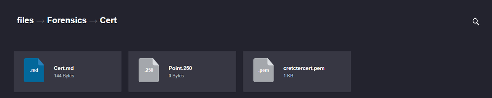
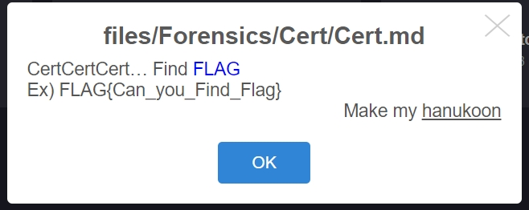
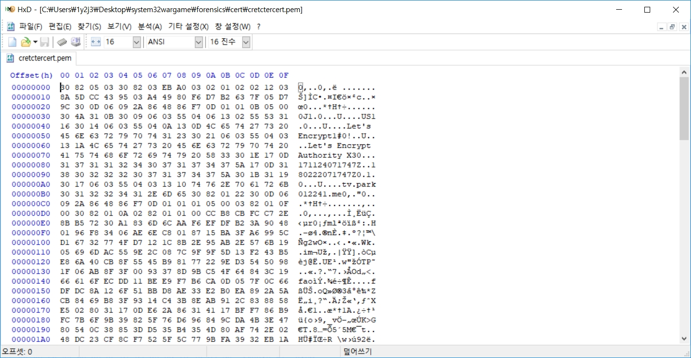
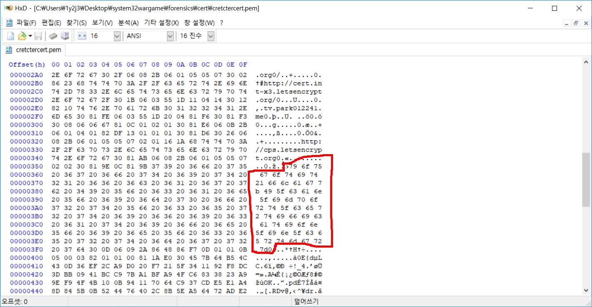
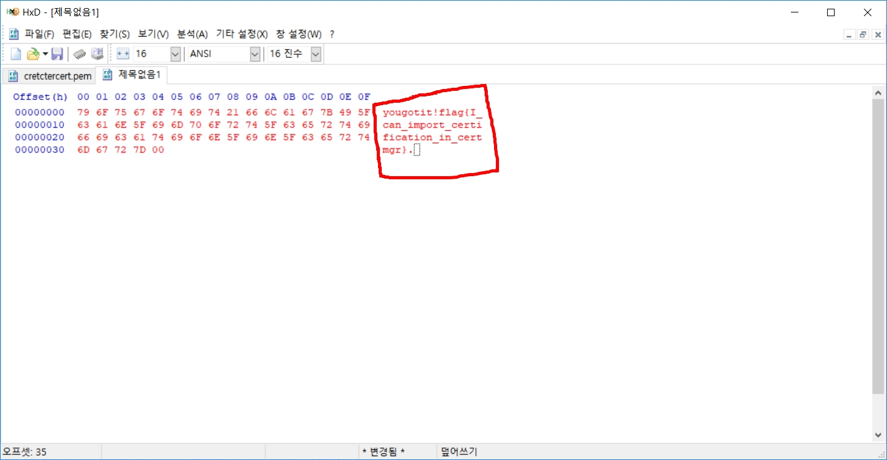

# System32.kr 문제

문제 풀이 입니다.

### Forensics - Cert

  
이 문제는 90점 문제입니다.
  

  
일단 cretctercert.pem 파일을 제공합니다.
 
이걸 HEX로 오픈합니다.
  

  
열게 되면 이렇게 나오는데 여기서 좀 내려봅니다
 
그럼 여기서 16비트 짜리가 적혀 있는걸 확인 할 수 있습니다.
  

  
여기서 지금 빨간색 부분을 HEX에서 새로운 창을 연 후 붙여넣기를 합니다.
  
그러면
  

  
그러면 flag가 나타납니다.
  

| yougotit!flag{I_can_import_certification_in_certmgr} | flag만 하면 |
| :------------- | :------------- |
| flag{I_can_import_certification_in_certmgr} |

  

