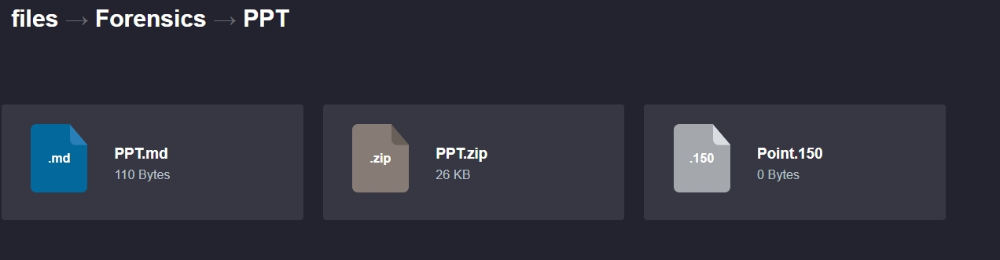
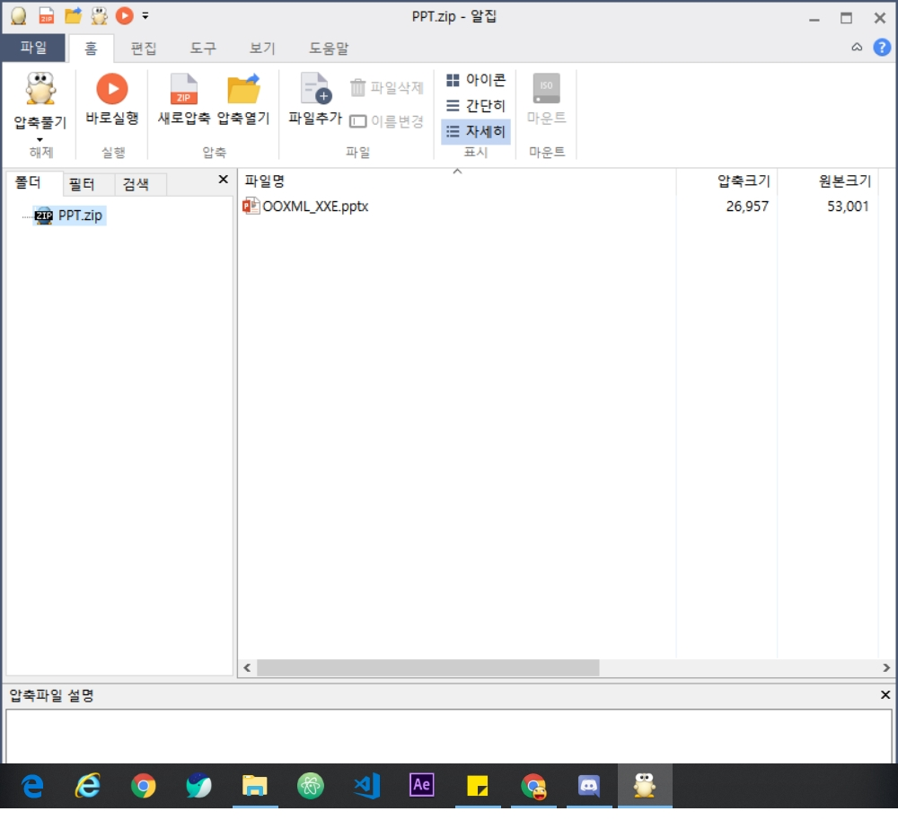
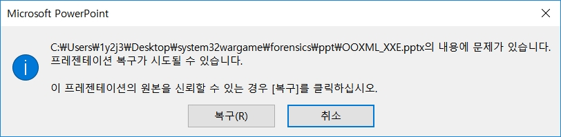
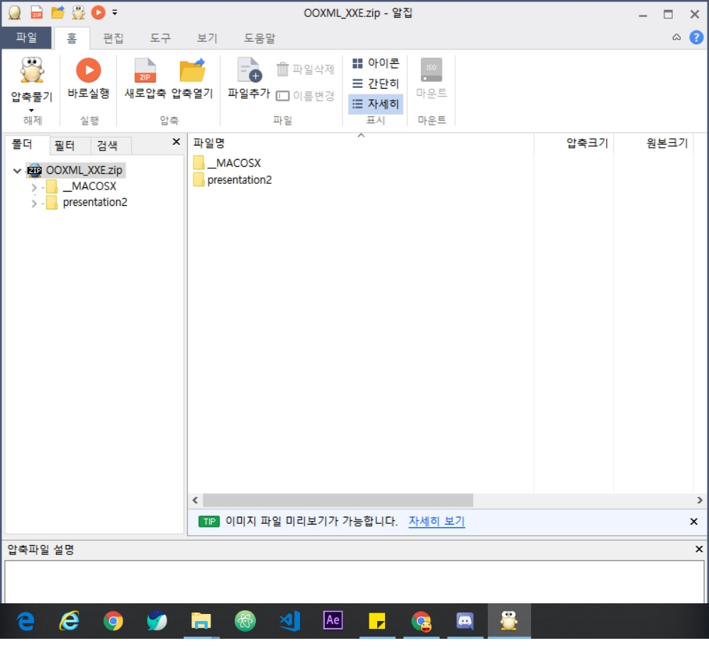
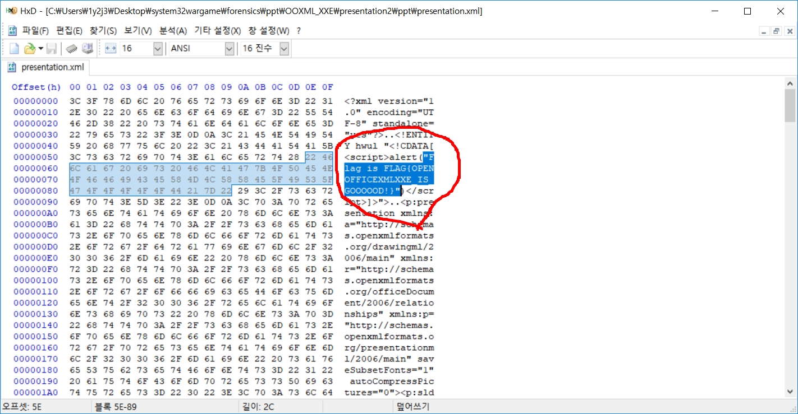

# System32.kr 문제

문제 풀이 입니다.

### Forensics - PPT

  
이 문제는 150점 문제입니다.
  

파일은 ppt.zip를 제공하고 이 파일을 압축해제하면 

  
OOXML_XXE.pptx를 준다. 
ppt를 열면
  

  
이렇게 나오는데 복구를 클릭하여 복구 시킵니다.
 
그럼 zip 하나가 생기면서 파일들이 많이 들어있는 것을 확인 할 수 있다.
  

  
폴더안에 파일들이 몇개 안되니 천천히 열어보았다.
  
그러다가 안 열리는 파일을 확인했다.
  
HEX로 열었더니 

  
그러면 flag가 나타납니다.
  

answer에다가 flag값을 넣으면 된다. 
flag : FLAG{OPENOFFICEXMLXXE_IS_GOOOOOD!}

  

