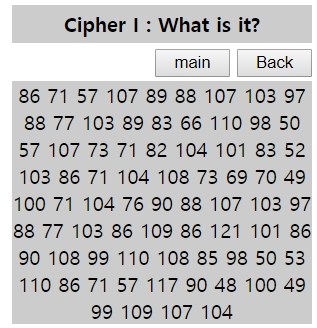
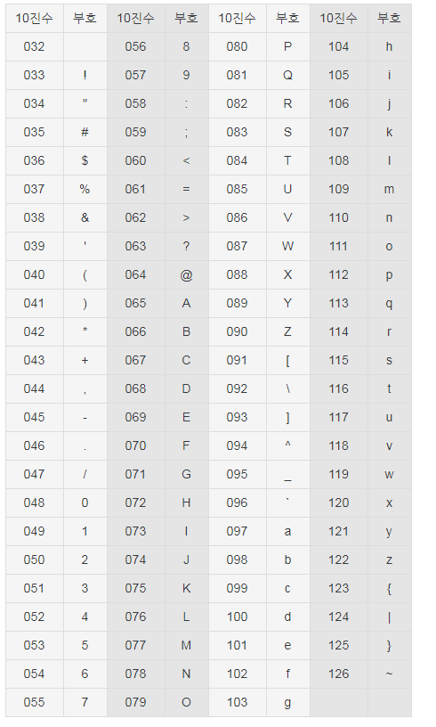
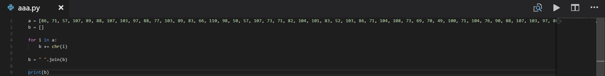
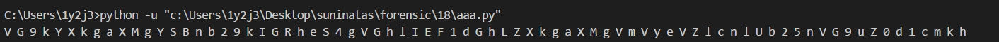
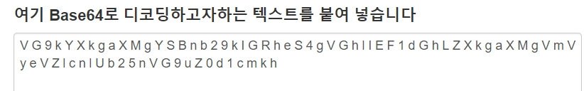
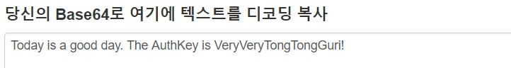
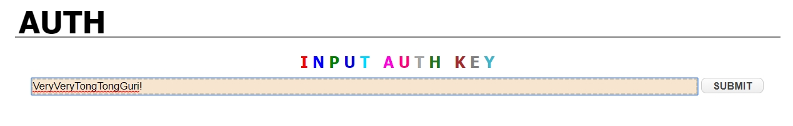

# 써니나타스 (http://suninatas.com/)
이 문제는 써니나타스 18번 문제 입니다.

## 문제 풀이 
맨 처음으로 18번 문제에 들어가면 Cipher l : What is it?라는 문구와 함께 숫자들이 주어진다.

저 숫자들을 보고 생각 난 것은 아스키코드 였다.

아스키코드란 미국 ANSI에서 표준화한 정보교환용 7비트 부호체계이다.
000(0x00)부터 127(0x7F)까지 총 128개의 부호가 사용된다. 이는 영문 키보드로 입력할 수 있는 모든 기호들이 할당되어 있는 부호 체계이며, 매우 단순하고 간단하기 때문에 어느 시스템에서도 적용가능하다는 장점이 있으나, 2바이트 이상의 코드를 표현할 수 없기 때문에 국제표준의 위상은 유니코드에게 넘어갔다. 

쨋든 아스키코드라는 것을 알고나서 해독 방법을 찾았다. 
ord(문자) : 문자의 ASCII 코드를 반환하고 chr(숫자) : 숫자에 대응하는 문자를 반환한다.

이걸 갖고 해독 코드를 작성했다.

그리고 실행해 보면 나오는 것은

저런 값들이 나오는데 어떤 것으로 인코딩 되어있다고 생각되어서 디코딩 하는 곳들에 다 넣어봤는데 그중에 값을 반출한 것이 base64였다

반출된 값은 

그러므로 auth값은 VeryVeryTongTongGuri!이다

