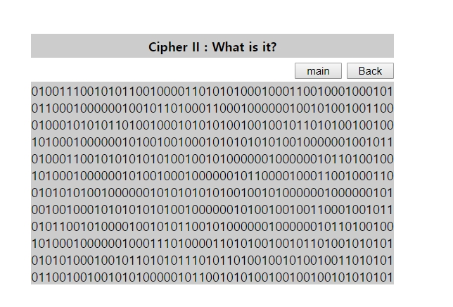
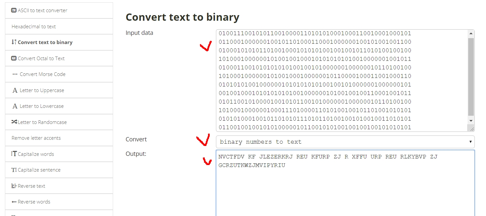
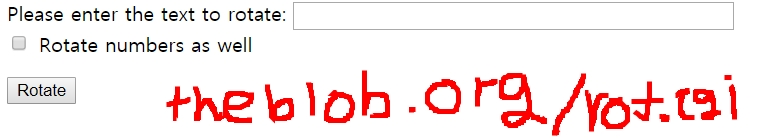
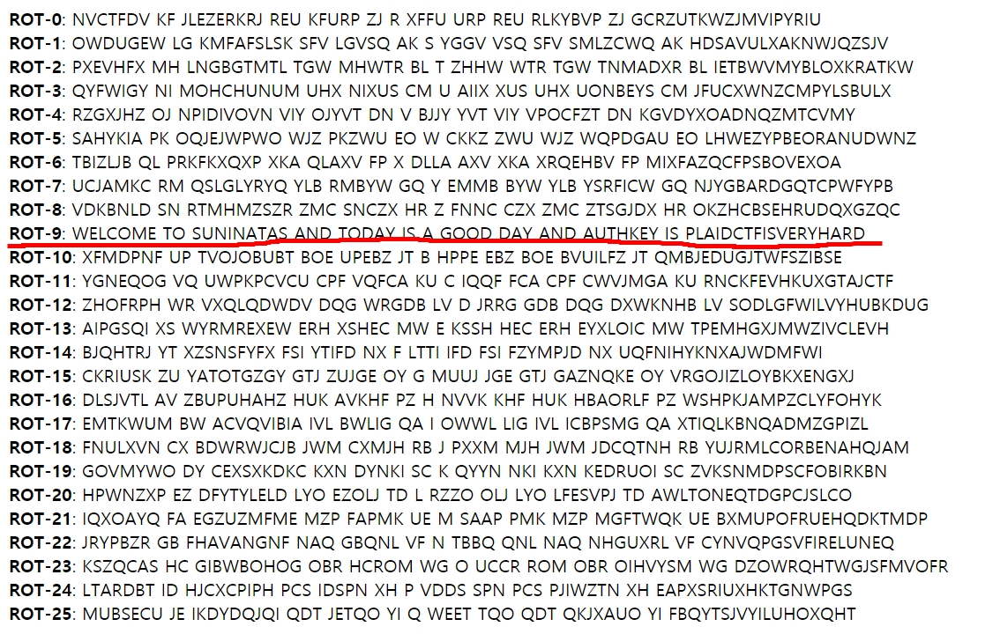
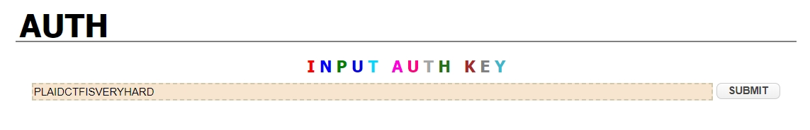

# 써니나타스 (http://suninatas.com/)
이 문제는 써니나타스 19번 문제 입니다.

## 문제 풀이 
맨 처음으로 19번 문제에 들어가면 0과 1로 짜여있는 것을 볼수 있다.

그리고 이 0과 1로 이루어진것을 해독하면 NVCTFDV KF JLEZERKRJ REU KFURP ZJ R XFFU URP REU RLKYBVP ZJ GCRZUTKWZJMVIPYRIU 라고 나온다.

처음엔 이게 뭔지 했다가 중3때 브레인스토링(?)떄 (퍼스트학원....) 배운게 생각났다.  
카이사르(시저) 암호라고 평문을 일정 거리를 두고 다른 알파벳으로 이동하는 것이다.

이런 형식이니 현재 나온 글자를 시저암호 변환 사이트를 이용해서 해석하면 되겠다. 
http://theblob.org/rot.cgi 사이트를 이용했다.

그리고 저기안에 글자를 입력하고 Rotate를 클릭하면 뭔가 쭉 나오는데 거기서 누가봐도 써니나타스에서 낸 문제라고 생각되는게 있다.

그렇다. 저것은 정답이다.
  authkey = PLAIDCTFISVERYHARD

