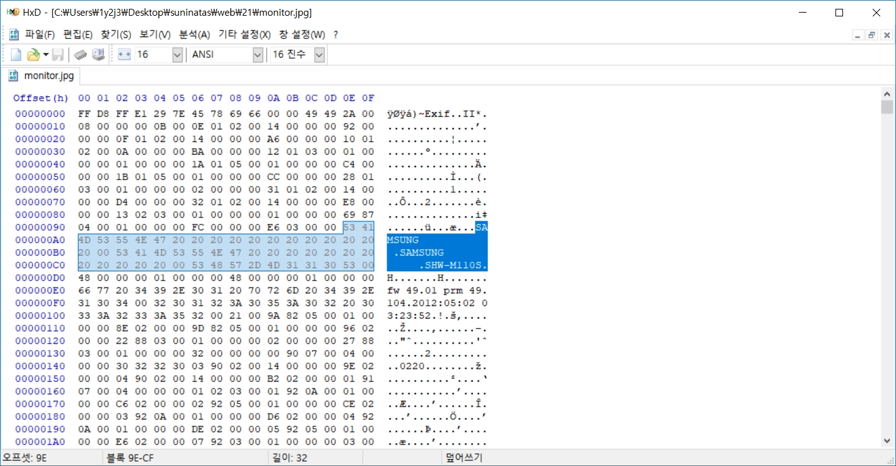

# 써니나타스 (http://suninatas.com/)
이 문제는 써니나타스 21번 문제 입니다.

## 문제 풀이 
맨 처음으로 21번 문제에 들어가면 authkey를 자로 가려진 사진이 나온다

그리고 이 사진을 다운 받으면 비정상적이게 파일이 크다.

그래서 이 사진을 hxd에 올려놔봤다.

보니깐 exif 확장자로 되어있는것 같다. 
exif란 디지털 카메라 등에서 사용되는 이미지 파일 메타데이터 포맷으로, JPEG, TIFF 6.0과 RIFF, WAV 포맷에 이미지나 소리에 대한 정보를 추가로 기록할 수 있다. 

그래서 그런지 무엇으로 촬영됬는지 나와있다.

그리고 좀 내려보니 사진들이 합쳐져 있는 것을 확인하고 일일이 수작업으로 분리했다.  
확장자가 나와있는 부분 ÿØÿá'¾Exi를 시작으로 같은 문구가 나올떄 까지 복사했다. 

첫번째로 분리한 사진은 다운받은 사진과 동일하다.

두번째로 분리한 사진은 살짝 옆으로 비껴져 나가있는 사진이였다.

이 사진 두개로도 authkey를 찾을 수 있었다. (나중에 풀이글을 보니 툴도 있고 사진은 총 15장 이였다는 것도 알았다.)  
authkey = H4CC3R_IN_TH3_MIDD33_4TT4CK

