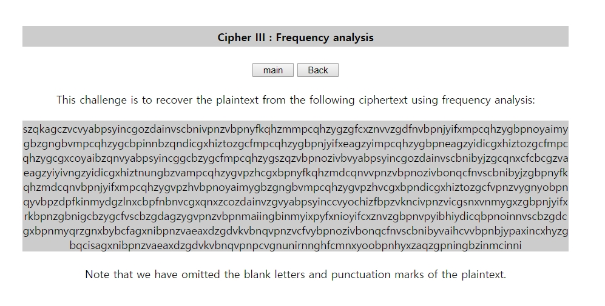
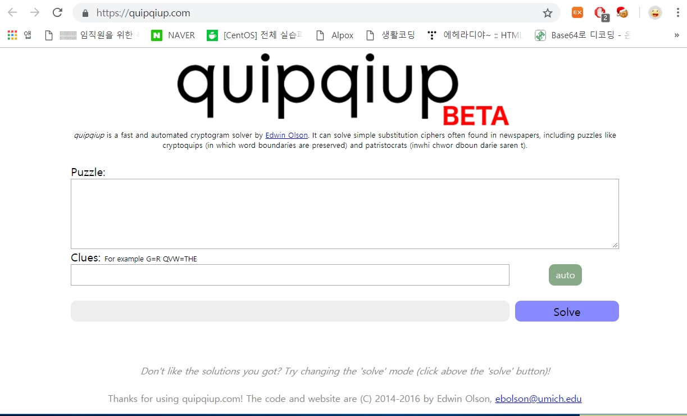
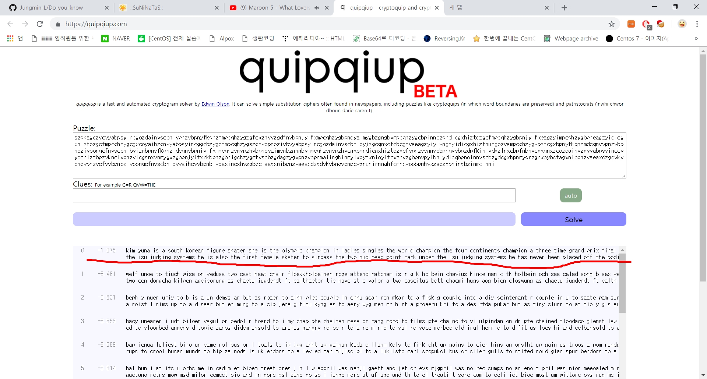
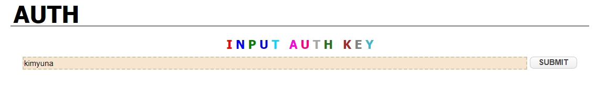

# 써니나타스 (http://suninatas.com/)
이 문제는 써니나타스 26번 문제 입니다.

## 문제 풀이 
맨 처음으로 26번 문제에 들어가면 Cipher lll : Frequency analysis 라고 적혀있고 영어단어들을 막 준다.

저기에 Frequency analysis을 해석해 보면 빈도수 분석이다.
즉 빈도분석을 이용해 암호문을 복호화 시켜서 문제를 푼다.

이 분도분석을 자동으로 해주는 사이트가 있다.
Https://quipqiup.com

아까 보였던 영어들을 다 복사해서 빈칸에 넣고 돌리면 저렇게 값들을 찾아준다.

답은 kimyuna이다
