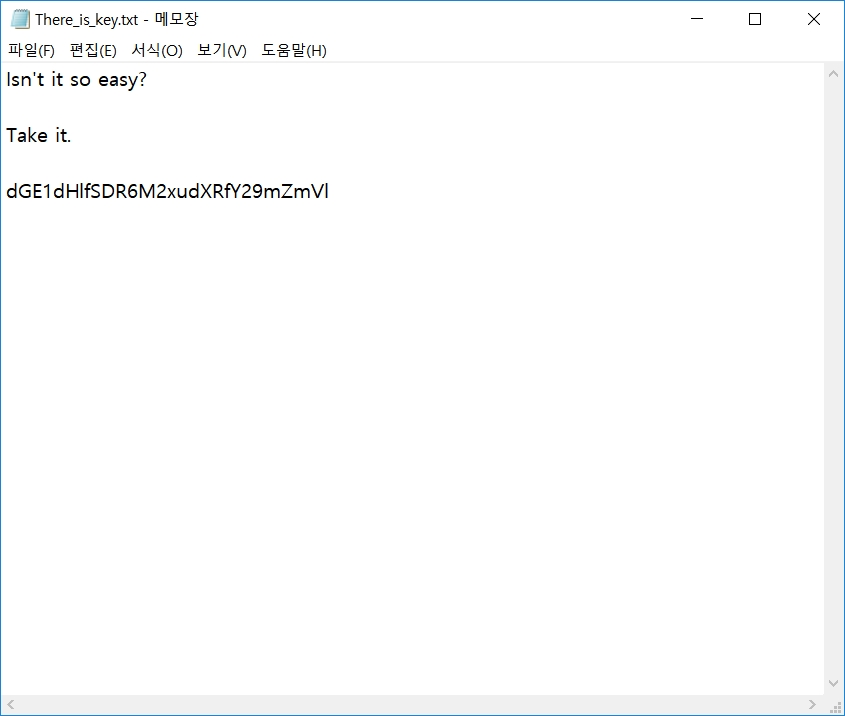

# 써니나타스 (http://suninatas.com/)
이 문제는 써니나타스 28번 문제 입니다.

## 문제 풀이 
맨 처음으로 28번 문제에 들어가면 사진이 주어진다.

그리고 download를 받고 풀어보면 비번이 걸려있는 파일들을 볼수 있다.

아마 password 인증 우회 해서 문제를 풀라는 것 같다.
그래서 hxd로 열어봤다.

그리고 저기에 pk로 시작하는 50을 기준으로 6,7번 째 칸에 보이는 09 08를 00 00으로 보이는 곳을 다 바꿔줬다.

그 다음 압축 푼 후 파일을 열어보면 3개가 있는데 첫번쨰 am_i_key2.txt에는 이런 내용이 있다.

am_i_key3.txt에는 이런 내용이 있다.

그리고 이 문제의 답이 들어있는 압축 파일이다.

안에 있는 메모장을 열면 나온다.

메모장에 적혀있는 것 중 dGE1dHlfSDR6M2xudXRfY29mZmVl은 base64로 인코딩 되어있는 것 같아서 디코딩 해줬다.
 authkey = ta5ty_H4z3lnut_coffee

