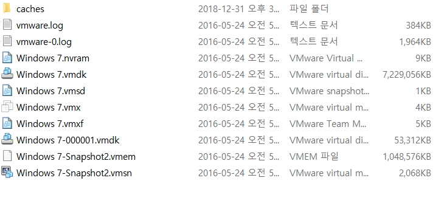
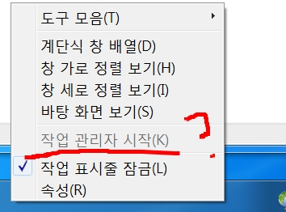
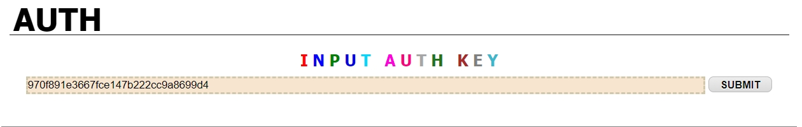

# 써니나타스 (http://suninatas.com/)
이 문제는 써니나타스 29번 문제 입니다.

## 문제 풀이 
맨 처음으로 29번 문제에 들어가면 형이 동생의 pc를 고치면서 장난을 쳐놨기 때문에 정상으로 돌려야 한다고 한다.

그리고 download를 클릭하면 Windows7(SuNiNaTaS)라는 파일이 다운되어진다.

그래서 hxd로 파일을 열었다.
열어보면 처음에 45 47 47로 시작하는 부분에 egg라 적혀있다.
아마도 egg파일이였던 것 같다.

확장자 egg를 붙힌 후 풀어보니 vm구동 파일들이 들어있었다.

VMware Workstation으로 열어봤다.

처음 키고 windows7이 구동되고 나서 갑자기 셧다운이 시작되길레 먼저 셧다운을 껏다.
명령어는 shutdown -a이다. (근데 이거 작성 후 풀이들을 보니 셧다운은 나만 있었던 것 같기도 하고...)

아무튼 windows7이 구동되고 나자마자 나오는 화면은 이렇다.

먼저 첫번쨰에 웹서핑은 잘되는데 네이버에만 들어가면 사이버 경찰청 차단 화면으로 넘어가는 부분을 먼저 확인 해 봤다.

이 첫번쨰 문제는 어디서 들어봤던 거인데 hosts에서 이런걸 담당한다고 들어서 검색창에다가 hosts를 검색한 후 파일 위치 열기를 하여 찾았다.

하지만 naver.com이 어디로 연결되어있는지 나와있지는 않았다. 

그래서 숨겨진 파일을 찾기 시작했다.

그러더니 hosts라는 파일이 발견되었다.

그리고 이 파일을 메모장으로 열었더니 내가 원했던 naver.com이 경찰청 차단화면가는 부분과 key가 나왔다.

두번째로는 불쌍하게도 키로거가 설치되어 있다고 한다.
우리가 이 키로거의 절대경로 와 파일명을 찾아야 한다.
키로거 같은 경우에는 작업관리자에서 서비스나 프로세스에 들어가서 수상한 것만 찾으면 되는데....

작업관리자가 열리지 않도록 설정 되어있었다...
그럼 열리도록 설정해야겠다.
레지스트리 값을 변경해주면 가능하다. 
win+r 한후 regedit을 친 후 밑에 있는 주소로 따라가면 변경할 수 있는 곳이 나온다.

저기 동그라미 안에 있는 숫자를 1로하면 잠기고 0으로 하면 풀린다.

설정하고 나오면 이렇게 풀린다.

그리고 작업관리자에 들어온 후 프로세스 탭에 들어가고 난 후 보니 딱 봐도 수상한 v1tvr0가 있다
v1tvr0의 파일 위치를 열어봤다.
그럼 두번째의 답이 나온다.

세번째로는 키로거가 다운로드 된 시간이다.
이건 다행히도 windows에서 사용된 것이 intetnet explorer 밖에 없기 때문에 이걸 까보면 된다.
나 같은 경우에는 index.dat analyzer v2.5를 사용했다. 

설치 및 실행 하고 나서 index.dat을 열어보니 pc-spy-2010-keylogger-surveillance-spy-3.exe가 다운된 흔적이 있다.
이 프로그램이 다운 된 날짜는 05/24/2016 04:25:06이다.
이게 세번째 답이다.

네번째로는 키로거를 통해서 알아내고자 했던 내용은 무엇인가 이다. 
이거 같은 경우에는 v1tvr0가 있는 파일위치로 가서 일일이 눌러봤다.
그러다가 사진이 많이 있는걸 보고 바로 피해버렸다... (나중에 이것도 다른사람 풀이 봤는데 사진에 힌트가 있네요...)
그리고 사진이 많이 들어 있는 폴더 밖에 있는 파일 2개가 있는데 그 두개를 열어봤다.

첫번째로 열어본 이것은 그냥 뭔가 적힌것 같다.
키로거 라고 하면 시간과 타자 쳐진것? 같은게 있는데...

두번째로 열어본 이것은 키로거라고 생각되는게 확신된다.
그래서 밑으로 천천히 내려보니 key가 있었다.

이로써 1번, 2번, 3번, 4번 문제를 다 풀었다.

여기 마지막에 인증키 형식은 lowercase(MD5(1번키+2번답+3번답+4번키))라고 적혀있는데 
현재 나온것을 조립하면 lowercase(MD5(what_the_he11_1s_keeyc:\v196vv8\v1tvr0.exe2016-05-24_04:25:06blackkey is a Good man)) 이다.

그러므로 29번 답은 970f891e3667fce147b222cc9a8699d4 이다.

