# 써니나타스 (http://suninatas.com/)
이 문제는 써니나타스 31번 문제 입니다.

## 문제 풀이 
맨 처음으로 31번 문제에 들어가면 PDF Analysis라는 주제가 써있는 페이지가 나온다.

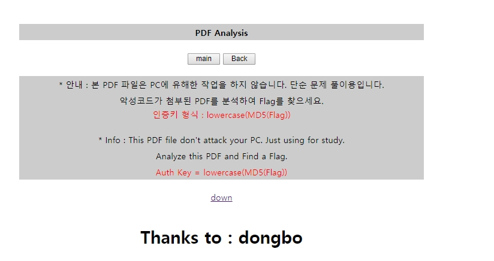

그리고 이 pdf를 열어보면 이런 내용이 나온다.

이 PDF를 뜯어보기 위해 PDFStream Dumper를 이용했다.
objects 20를 보면 java script가 존재 하는걸 볼수 있다.

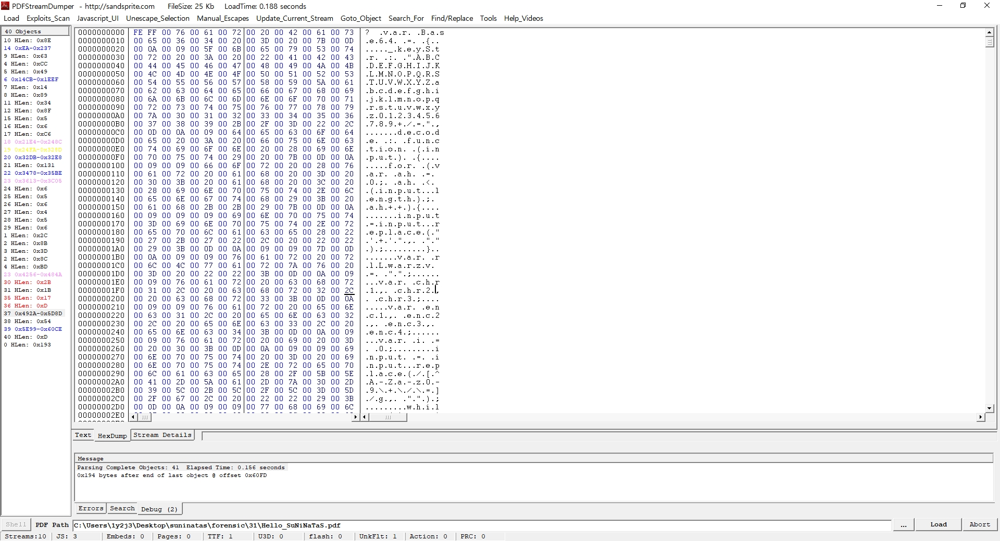

그리고 그 부분은 javascript_UI를 이용해서 보면 이렇게 나온다.

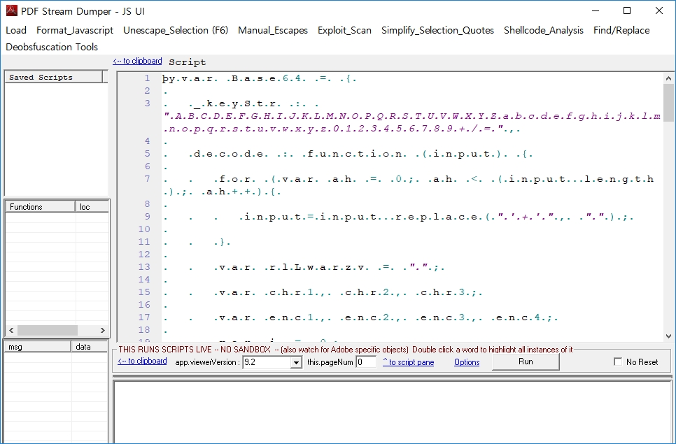

그 다음 좀 내려보면 base64로 인코딩 되어있는 문구들을 볼수 있었다.

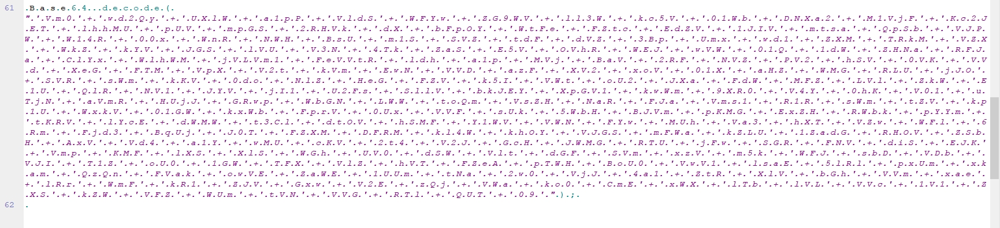

그 문구들을 디코딩 시키면 이렇게 나온다.

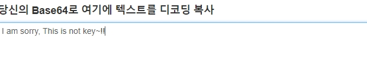

그래서 object를 더 둘러보는중 39번에 pdf파일 안에 pdf파일이 하나 더 숨어져 있다는 것을 확인했다.

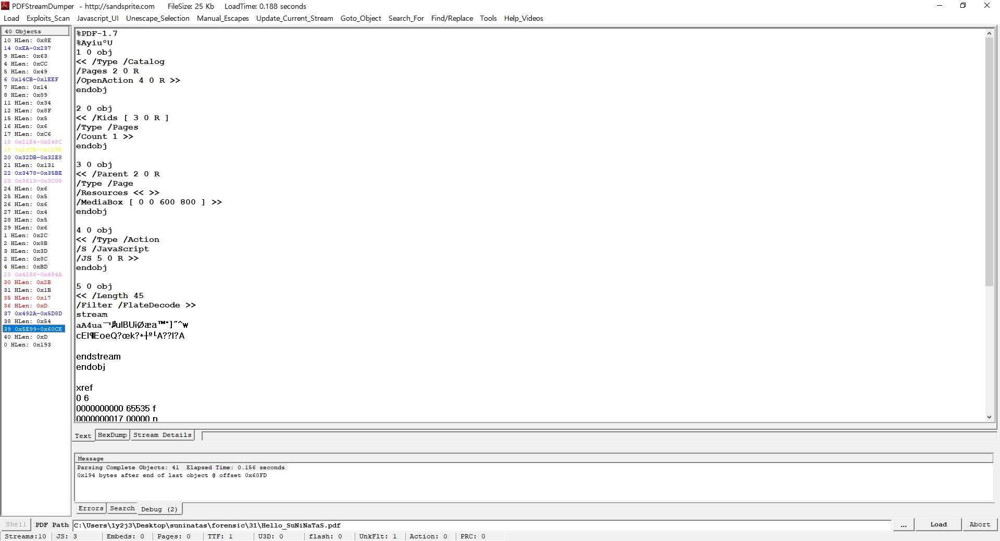

39번에 save Decompressed stream를 클릭해서 파일을 만들었다.

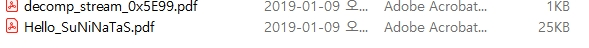

실행 시켜보니 아무내용 없고 제목쪽에 보안이라는 글자가 적혀있었다.

그래서 pdf 보안 해제라고 친 후 첫번째에 나오는 곳에다가 파일을 올렸다.

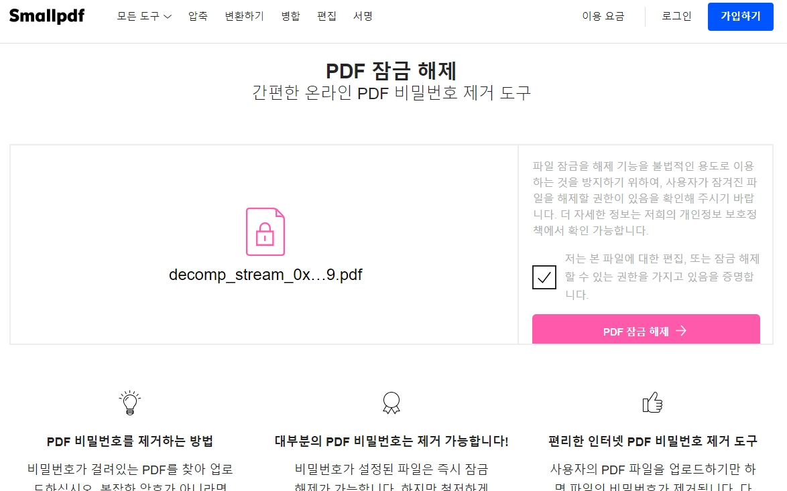

암호를 제거하고 파일을 여니 역시 아무 내용도 적혀있지 않았다.

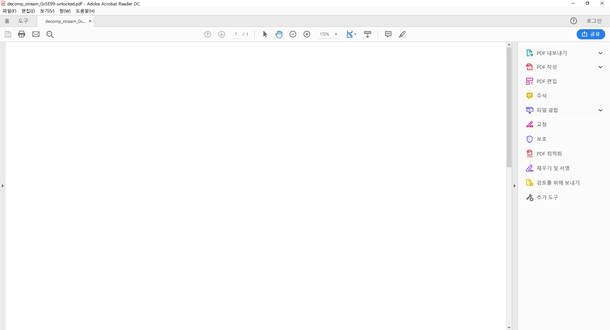

그 파일을 다시 PDFStreamDumper에 올려놔 보았다.
object7번에 플레그가 적혀있었다.

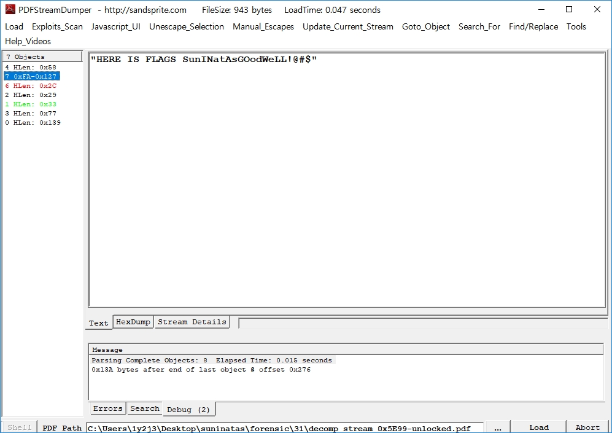

Flag : SunINatAsGOodWeLL!@#$ 
 
MD5(SunINatAsGOodWeLL!@#$)  
 
그리고 md5로 해석하면 

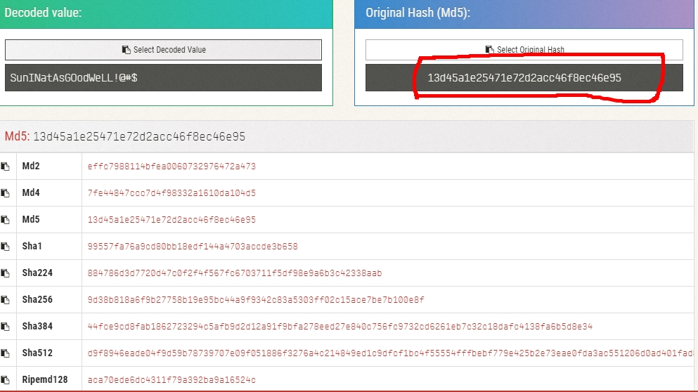  

결론 답은 13d45a1e25471e72d2acc46f8ec46e95이다. 

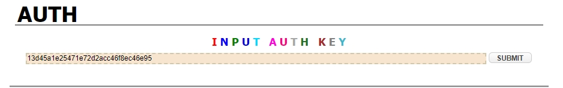 