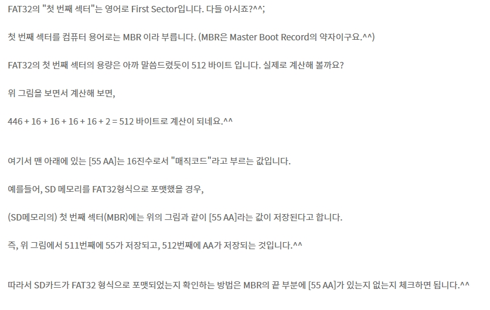

# 써니나타스 (http://suninatas.com/)
이 문제는 써니나타스 32번 문제 입니다.

## 문제 풀이 
맨 처음으로 31번 문제에 들어가면 골치 아프게 길게 적혀있었다. 

Download를 눌러서 파일을 Hxd로 까보면 이렇게 포맷정보를 알수 있었다. 

먼저 이 문제를 풀기 전에 FAT32의 섹터 구조를 이해해야 했다. (참조 : https://yebig.tistory.com/117) 

그래서 55 AA가 있는 걸 체크했다.

그리고 디지털포렌식위키피디아에서 FAT16과 FAT32부트 레코드 공통 항목 설명에 0x1FE~0x1FF가 부트레코드가 손상되었는지 아닌지를 알기 위한 용도로 사용된다는데 시그니처 위쪽으로 밀려있는걸 확인하여 NULL값으로 맞춰나가기 시작했다.

NULL값을 넣고나서 섹터 1과 섹터 6를 비교하니 맞아 떨어지길레 바로 저장해서 AccessDate FTK imager로 열어서 내용물을 확인했다.

저기 보이는 2차 테러 계획.hwp를 열어보니 이렇게 적혀있었다.

장소는 Rose Park이다.

그 다음 또 요구한게 파일 수정일시를 물어봤는데 그런걸 속성들어가면 나온다.

2016년 5월 30일 오전 11:44:02이다.

인증키 형식 : lowercase(MD5(YYYY-MM-DD_HH:MM:SS_장소)
그대로 입력해 보면 lowercase(MD5(2016-05-30_11:44:02_Rose Park)) 

그리고 MD5 복호화 시키면 8ce84f2f0568e3c70665167d44e53c2a가 나온다. 

