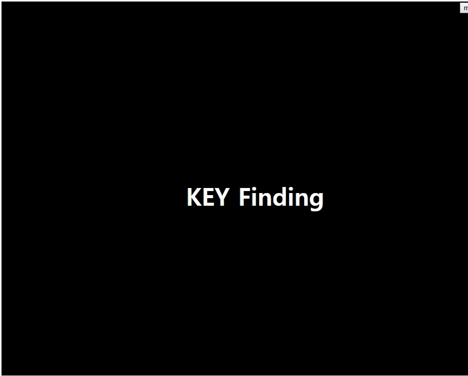
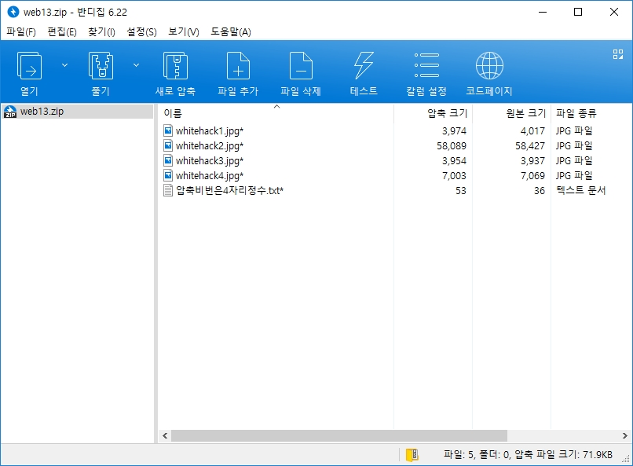

# 써니나타스 (http://suninatas.com/)
이 문제는 써니나타스 13번 문제 입니다.

## 문제 풀이 
맨 처음으로 13번 문제에 들어가면 키를 찾으라고 한다.

그래서 아무생각없이 개발자 탭을 켰더니 힌트를 던져준다.

사진을 다운받을려고 보니깐 html파일만 던져준다.

그래서 web13.확장자에다가 별걸 다 써봤는데 zip을 치니깐 다운로드가 되었다.

그리고 압축안을 보니 암호화가 되어있다.

그래서 ARCHPR로 암호화작업을 시작했다.

1초걸려서 찾은 비번은 바로 7642였다.

먼저 메모장에 뭐가 적혀있는지 궁금해서 열어봤다.

사진에 뭔가 적혀있나 궁금해서 hex로 열었더니 첫번째 값이라는 것이 나와버렸다

두번째 키

세번째 키

네번째 키

그래서 찾은 키를 한곳에 모아둔 뒤 한줄로 정리했다

답은 3nda192n84ed1cae8abg9295cf9eda4d 이다.

