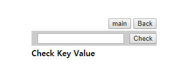
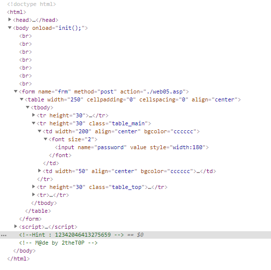
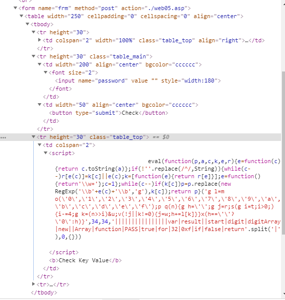
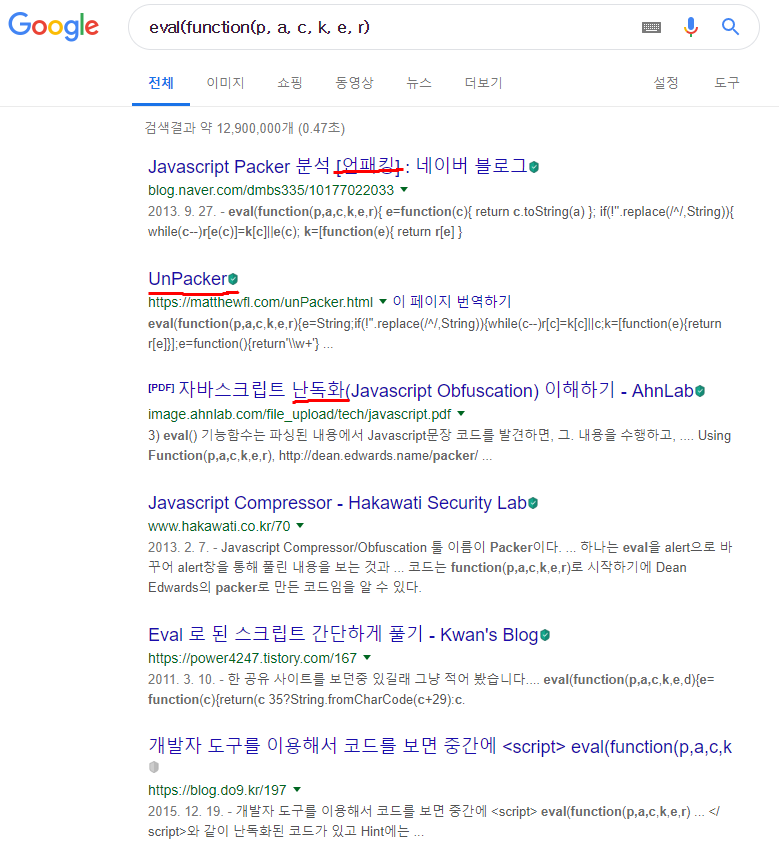
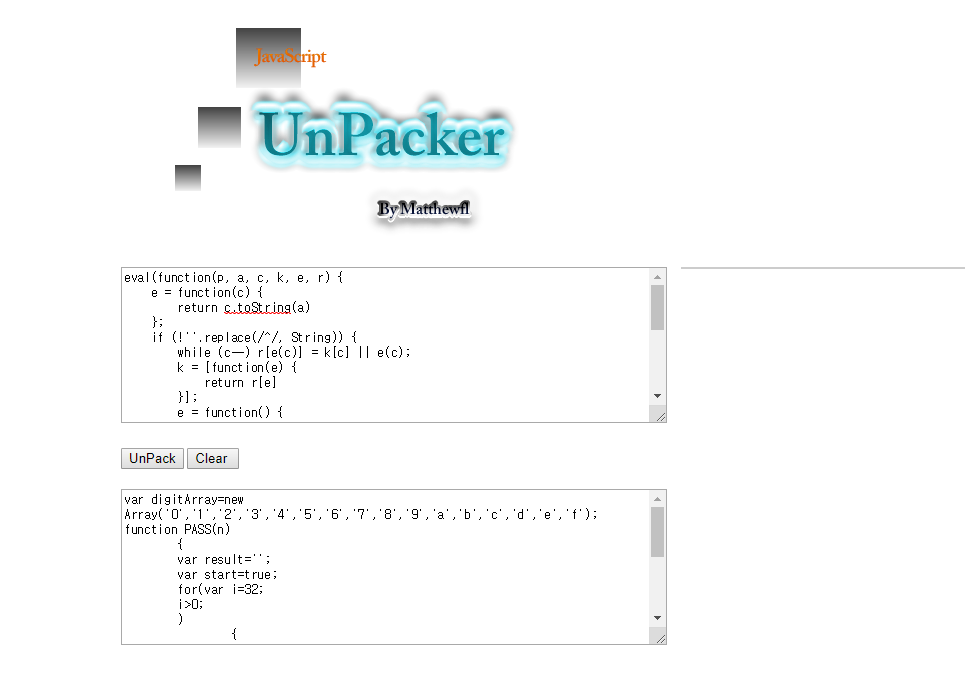
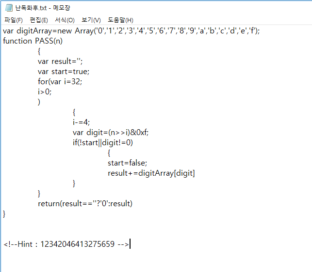
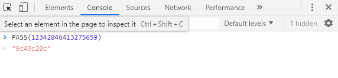
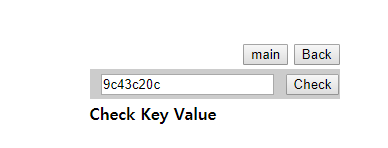
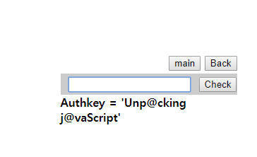
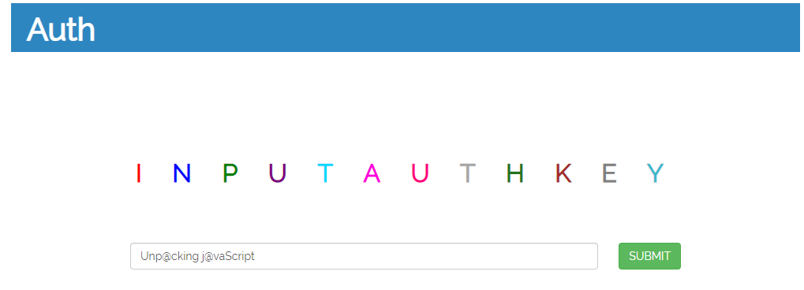

# 써니나타스 (http://suninatas.com/)
이 문제는 써니나타스 5번 문제 입니다.

## 문제 풀이 
맨 처음으로 5번 문제에 들어가면 뭔가를 넣을 수 있는 칸이 나온다.

난 생각없이 크롬 개발자 도구를 켜서 소스를 확인했다.

여러군데 눌러보다가 찾은 스크립트이다.

eval(function(p, a, c, k, e, r))이 뭔지 몰라서 구글에다가 검색해봤다.

그래서 나는 스크립트안에 있는 것들을 난독화해주는 사이트에다가 넣어서 돌려봤다.

난독화 후에 나온 것들과 힌트를 적어두고 생각해봤다.

PASS라는 함수에다가 숫자를 입력하면 되는것 같아 힌트에서 준 12342046413275659를 이용해서 값을 넣어봤다.

그러고 나니 결과값을 줬는데 그걸 입력하는 곳에다가 넣어봤다.

역시 생각한대로 Authkey값을 줬다.

그러므로 5번의 정답은 Unp@acking j@vaScript 이다. 

