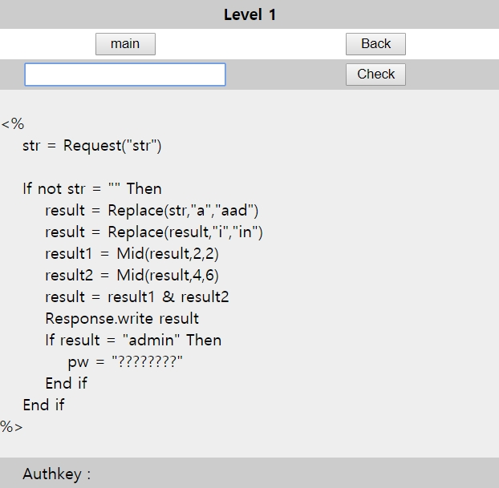
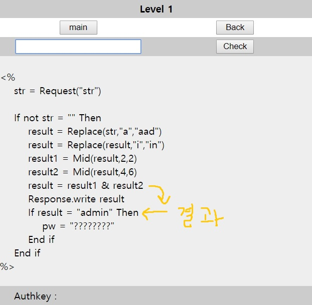
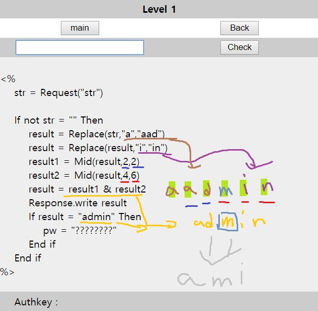
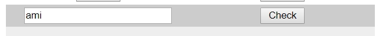
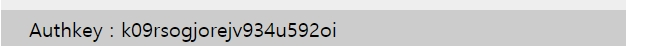
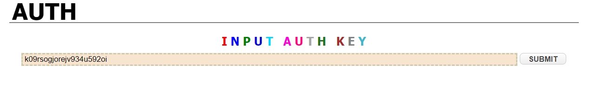

# 써니나타스 (http://suninatas.com/)
이 문제는 써니나타스 1번 문제 입니다.

## 문제 풀이 
맨 처음으로 1번 문제에 들어가면 어떤언어로 짜여있는 코드를 확인할수 있다.

저 짜여있는 코드는 php로 짜여있다.
그 중에서 mid함수와 Replace함수이다.

mid 함수란 자신이 시작하고 싶은 번째 문자에서 자신이 설정한 만큼의 길이 만큼 우측에서 문자열을 반환하는 함수이다.
Replace 함수란 문자열을 치환하는 함수이다.

그럼 일단 치환하고 문자열을 추출해서 만들어져야 하는 것은 admin이다

그러면 a는 aad로 i는 in으로 치환되고 그럼 2번째 부터 2칸 , 4번째 부터 6번째 이므로 admin이 만들어 질려면 가운데에 m이 있어야 한다.
그리고 총 6칸이므로 뒤에 세칸이 min이고 앞에 세칸이 aad 이지만 2번째부터 2칸이므로 ad, 4번째 부터 6째칸까지는 min 이다.

이 값을 넣으면 authkey값을 제공한다.

그리고 밑에 보면 key값 부분에 글씨가 나타난다.

그러므로 1번의 정답은 k09rsogjorejv934u592oi 이다.

