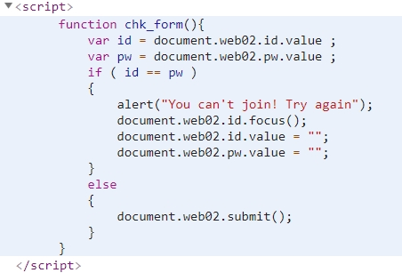

# 써니나타스 (http://suninatas.com/)
이 문제는 써니나타스 2번 문제 입니다.

## 문제 풀이 
맨 처음으로 2번 문제에 들어가면 로그인 창이 뜬다.

크롬에서 개발자도구 탭을 열어서 join부분을 찍어봤더니 버튼을 누르면 chk_form을 수행한다.

그럼 저건 어디 있을까? 라고 생각하는 중 script부분이 보였다.

그리고 힌트 부분이 있었다. 

이 문제는 javascript를 우회하라는 의도로 출제 된것 같다.
그래서 join버튼을 이용하지 않고 풀기로 했다.

먼저 id와 pw에다가 동일한 값 a를 넣기로 했다.

그 다음 개발자도구에 보면 콘솔(console)부분을 키고 main(web2.asp)로 잡은 후 아까 봤던 스크립트중에서 만약 id = pw 라고 하면 다시 도전하라는 값을 제공하고 이게 아니면 authkey를 주는 방식 이였으므로 else에 적혀있던 docment.web02.submit();를 콘솔에다가 입력해준다.

그러면 아까 로그인 창에 보면 id 와 pw안에 있던 값은 사라지고 authkey 값이 적혀진다.

그러므로 2번의 정답은 Bypass javascript 이다.

