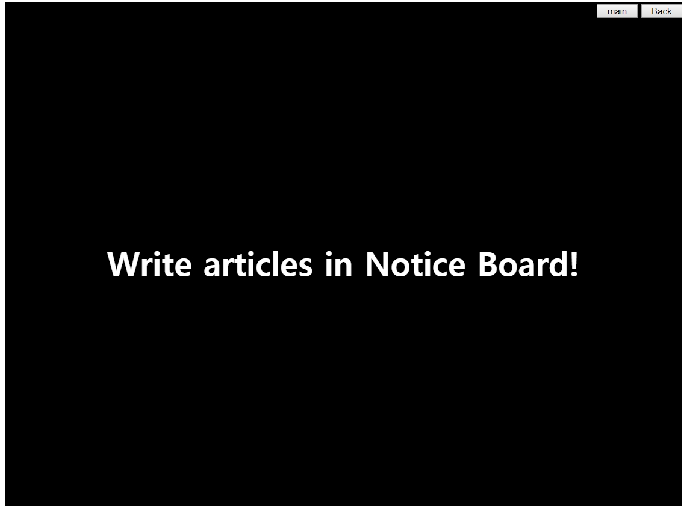
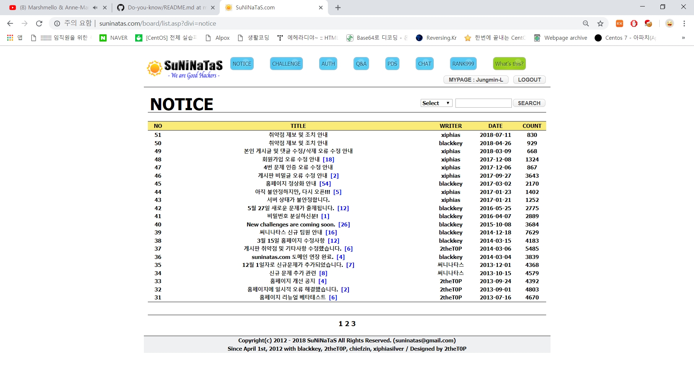
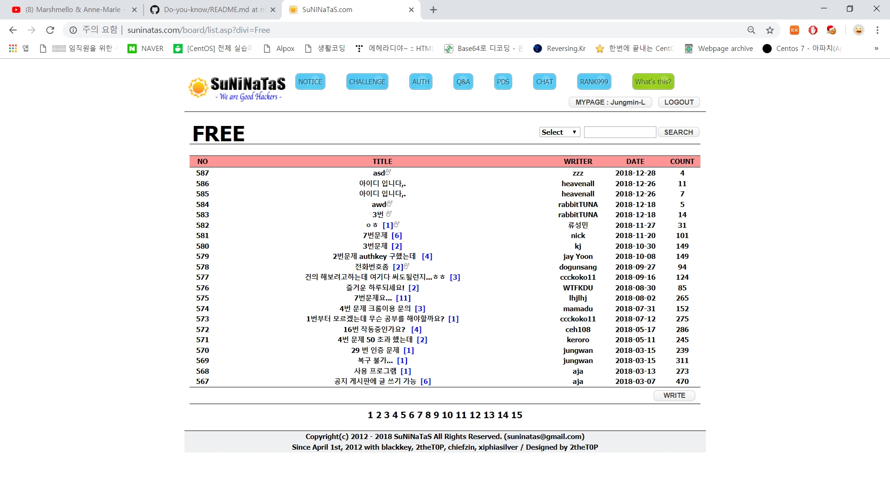
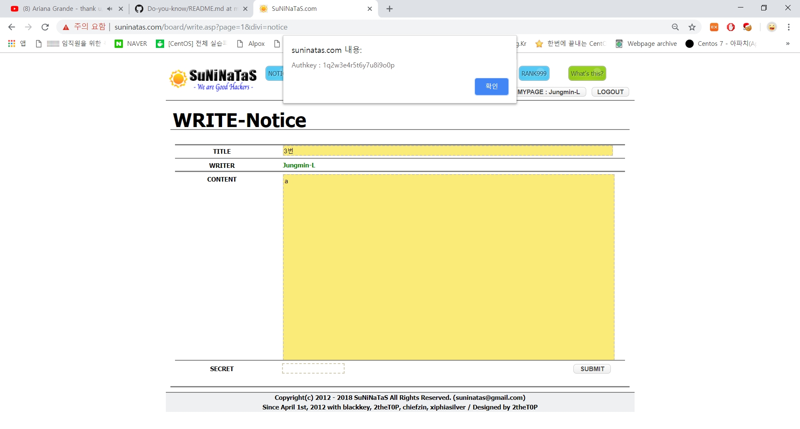
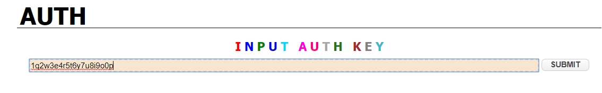

# 써니나타스 (http://suninatas.com/)
이 문제는 써니나타스 3번 문제 입니다.

## 문제 풀이 
맨 처음으로 3번 문제에 들어가면 검은색 화면과 글씨가 뜬다.

일단 notice게시판으로 가봤다.
하지만 여기에는 게시글을 작성할수 없다.

그럼 우리가 게시글을 작성할 수 있는 Q&A로 가봤다.

위에 주소들을 보니 /board/list.asp?divi=notice, /board/list.asp?divi=Free 로 divi값만 다르다.
그럼 생각을 해보면 Q&A에는 게시물을 작성 할 수 있지만 notice에는 못하니 작성하는 곳으로 들어가서 divi값을 변경해주면 되지 않을까?

그런 생각으로 먼저 Q&A write로 들어왔더니 예상대로 divi=Free가 있다.
그럼 divi값을 notice로 바꿔보자!

write-notice로 바뀌었다. 
그럼 여기다가 글을 작성해 보자.

게시글에 제목과 글을 넣고 전송버튼을 누르니 authkey가 나왔다.

답은 1q2w3e4r5t6y7u8i9o0p 이다
