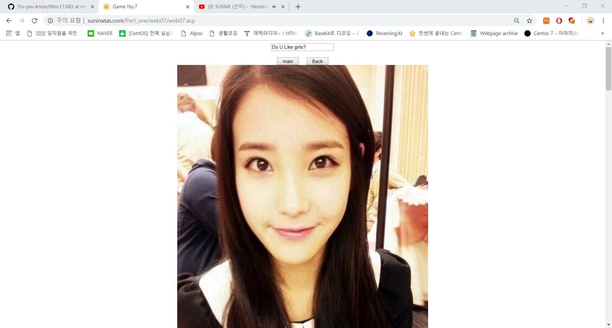
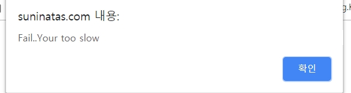
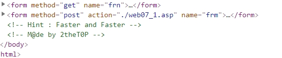
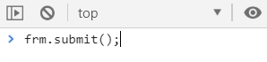
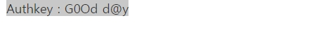
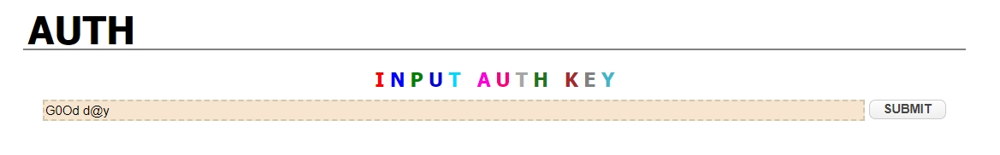

# 써니나타스 (http://suninatas.com/)
이 문제는 써니나타스 7번 문제 입니다.

## 문제 풀이 
맨 처음으로 7번 문제에 들어가면 누나들(?)이 나온다. 

그리고 좀 내리면 yes버튼이 나온다.

누르면 실패... 너는 너무 느려 라는 창이 나온다.

크롬의 개발자 탭을 들어오니 hint가 나온다.

그럼 사이트가 새로그침 되자마자 클릭이 되야한다는 이야기이기 때문에
frm.submit();를 콘솔창에 새로고침되자마자 바로 입력했다.

그리고 10번 안되서 authkey값이 나온것 같다.

authkey값은 G0Od d@y이다.

